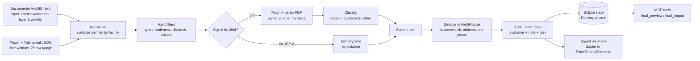

# Commercial Rodent Lead Scraper: Sacramento County inspections to FieldRoutes

Status: plan only, no code written. Written 2026-09-07 from live checks against the county data, the portal, and Zest's FieldRoutes tenant (read-only). Anything not verified is marked **unverified** and appears in the validation checklist.

## 1. Summary and recommendation

Build a small, scheduled pipeline inside this repo that turns Sacramento County's public food-inspection records into a ranked morning call list for the commercial rodent division, delivered straight into FieldRoutes as inactive commercial customers with a note and a task in the sales rep's queue.

Key findings that shape the design:

- **Don't scrape the portal HTML.** The county publishes the same data as an open ArcGIS feature service under a CC0 licence (6,211 facilities, 41,055 inspection rows back to 2023, refreshed nightly, about 3 days behind the portal). It is a clean JSON API, polite to use, and legally unambiguous. The portal itself (`inspections.myhealthdepartment.com`) returns 403 to non-browser clients and has a captcha path.
- **The rodent signal lives in the PDF, not the feed.** The feed's violation category "VERMIN AND ANIMAL CONTAMINATION" is mostly German cockroaches. The inspection report PDFs (linked from every feed row) have a text layer with the inspector's narrative ("hundreds of rodent droppings observed on the counter below the merchandisers") plus the **owner's name and a phone number** in the page header. Fetching one PDF per flagged facility (1 to 3 per working day) gives the rep a quotable, dated fact and a number to dial, with no ZoomInfo needed for single-location owners.
- **The ICP-tier event pool is small.** In the last 12 months only about 38 facilities in the A/B tiers (large and mid markets, commissaries, ethnic markets, multi-location restaurants) had a vermin or closure event. Rodent-only events are fewer still. So the pipeline needs a second "territory" lane: the 319 independent ICP-A facilities with no violation, fed at a few per day ordered by distance from the Rio Linda office, so the list is never empty and stays route-dense.
- **Food warehouses and distributors are not in this data.** They are licensed by the state (CDPH Food and Drug Branch), not the county, and no public list was found. That ICP segment is a ZoomInfo play, out of scope for this scraper.
- **Placer and Yolo are on the same portal but have no open-data feed.** Placer (`/pchd`) and Yolo (`/yolocountyeh`) expose the same JSON search call as Sacramento, with the inspector's narrative inline in a `comments` field, so pest mentions are visible without opening a PDF. There is no ArcGIS feed for either, so for these two counties the portal's JSON call is the primary source and must be used gently: 25 rows per request, date-window pulls, 2 seconds between calls. Placer runs about 20 inspections a working day (including pools and body art), Yolo about 8. Placer's report PDFs carry no owner name or phone; Yolo's carry the permit holder's email and sometimes a phone.
- **FieldRoutes already models leads the way we need.** Zest's existing leads are status-0 (inactive) customers with a lead subscription (`active = -3`), sold by Sean (employee 10007). The customer record's `customerLink` field is a free-text external ID that is searchable, which gives exact dedupe against the county's `Facility_ID`.

Recommended shape: a `src/fr_mcp/leads/` package with an `fr-leads` command and one source adapter per county (Sacramento ArcGIS feed; Placer and Yolo portal JSON), run daily as a second Railway cron service from the same Docker image, writing through the repo's existing hardened FieldRoutes client and write guards. Two curated MCP tools (`lead_preview`, `lead_import`) come in phase 2 so Claude can show and import leads conversationally. Zapier receives a daily digest webhook and handles Slack/Gmail delivery and optional ZoomInfo enrichment. Total effort about 11.5 working days across four phases; first Sacramento leads in Sean's queue at the end of phase 1 (about 4 days), Placer and Yolo in phase 2.

## 2. What the data actually contains

### 2.1 Primary source: Sacramento County ArcGIS feature service (CC0)

`https://services1.arcgis.com/5NARefyPVtAeuJPU/arcgis/rest/services/Food_Inspections/FeatureServer`

| Layer | Rows | Meaning |
| --- | --- | --- |
| 0 Facilities (points) | 6,211 | One row per `Facility_ID`, the facility's most recent inspection, with lat/lng (34 rows lack geometry) |
| 1 Inspection & Violation History (table) | 41,055 | One row per inspection per permit, 2023-09-09 to 2026-09-04 |

Fields on both: `Facility_ID` (e.g. `FA0001006`), `Facility_Name`, `Facility_Address` ("1016 10th St, Sacramento 95814-3502": street, city, zip+4, no state; 9 rows carry "CA, USA" noise, 1 lacks a zip), `Description` (permit type; the value `FOOD PREP ESTAB ` has a trailing space), `Inspection_Service`, `Inspection_Type`, `Inspection_Result`, `Inspection_Date` (epoch ms), `Inspection_Report` (PDF URL whose `pKey` is the inspection GUID), `Violation_Description` (comma-joined category names, each optionally suffixed "[Corrected at time of Inspection]"; 468 distinct combinations; null on 30,032 rows).

Query mechanics: standard ArcGIS REST (`where` SQL, `outFields`, `resultOffset`/`resultRecordCount` at 2,000, `outStatistics`/`groupByFieldsForStatistics`, `returnCountOnly`, `outSR=4326`). A full layer-0 pull is 4 requests. Freshness: data edited daily about 03:00 Pacific; newest inspection is about 3 days old on any given day.

Two quirks to design for: one facility can hold several permits (99 Ranch on Florin Rd has five: retail floor, bakery, dim sum station, seafood department, bakery kitchen), so `Facility_ID` is the lead key and permits collapse under it; and the same inspection GUID can appear on more than one layer-1 row, so inspections dedupe on `pKey`.

### 2.2 Facility types and the ICP

| County permit type | Count | ICP tier | Notes |
| --- | --- | --- | --- |
| RETAIL MARKET (15000+SQ.FT) | 147 | A | 99 Ranch, Bel Air, Costco, Smart Foodservice, La Superior; many are chains |
| RETAIL MARKET (6000-14999 SQ.FT.) | 51 | A | A&A Supermarket, Alibaba Halal, Babylon City Market, Corti Brothers, Del Valle |
| COMMISSARY | 42 | A | shared/cloud kitchens, caterers, school food service |
| RETAIL MARKET (LESS THAN 6000 SQ FT) | 700 | A- when the name says market/carniceria/seafood/bakery/halal etc. (about 167), else C (liquor and convenience) | |
| FOOD PREP ESTAB | 1,212 | A- when the name says bakery/panaderia/catering/commissary/kitchen/meat/seafood (about 76), else C | mostly coffee shops, 7-Elevens, delis |
| RESTAURANT WITH BAR | 488 | B | |
| RESTAURANT | 2,379 | B when a local multi-location operator, else C | |
| SATELLITE FOOD DISTRIBUTION FACILITY | 19 | B | mostly school/hospital satellites; two are supermarket warehouses |
| LICENSED HEALTH CARE FACILITY | 50 | B (low) | nursing homes; corporate procurement |
| SCHOOL/SENIOR MEAL, SCHOOL SATELLITE, MOBILE FOOD, BAR, FARMERS' MARKET, PRE-PACKAGED (<300 sq ft), PRODUCE/FARM STAND, VETERANS' ORG | 1,123 | excluded | not owner-accessible or no rodent exposure |

Name-keyword hits across layer 0: "market" 268, "supermarket" 49, "grocery" 29, bakery-type words about 85, fish/seafood 44, meat/carniceria 23, catering 27, "wholesale" 12 (almost all Costco). 402 base names (store number stripped) account for 1,880 facilities; a base name occurring 5 or more times is a reliable chain detector (catches Jimboy's 15, Pizza Guys 13).

Independent (non-chain) ICP-A facilities: 319, of which 174 are within 10 miles of the office and 132 within 10 to 20 miles. Chain ICP-A: 155.

### 2.3 Signal volumes (last 12 months, layer 1)

| Signal | Rows | Distinct facilities |
| --- | --- | --- |
| VERMIN AND ANIMAL CONTAMINATION category | 273 | 165 (98 restaurants, 21 food prep, 18 small markets, 11 restaurant-with-bar, 2 commissaries, 1 large market, rest excluded types) |
| Result CLOSED | 210 | |
| Result SUSPENSION OF PERMIT TO OPERATE | 36 | |
| Result CRITICAL VIOLATIONS | 275 | |
| Result CONDITIONAL PASS | 712 | |
| 2+ vermin-flagged inspections in 24 months | | 85 (e.g. GOLDSTAR SUPERMARKET 4, LA SUPERIOR #2 4, LA SUPERIOR SUPERMERCADOS 3, VALERIO'S TROPICAL BAKE SHOP 3) |
| Vermin or closure event in an A/A-/B facility | | about 38 |
| New A/A-/B signal facilities per day (last 90 days) | | under 1 |

### 2.4 The inspection report PDF

URL pattern: `https://inspections.myhealthdepartment.com/sacramento/print/?task=getPrintable&path=sacramento&pKey=<GUID>`. 150 to 900 KB, 3 to 6 pages, needs a browser User-Agent, has a real text layer (pypdf extracts it).

Every page repeats a header: `Owners Name<OWNER>Est Name<NAME>`, `City<city>Address<street> Zip<zip> Phone<phone>`, `FA<FacilityID> Permit ID<PR…> Purpose<…>`, `Prog Identifier<department> - PE: <code> CT: <tract>`. Verified examples: ("HAROON KHAN", "BUD'S BUFFET", "(510) 376-3395"), ("J-285 INC", "KFC/ A&W #181", "(916) 525-3600"), ("KHP SACRAMENTO LLC", "SEAPOT", phone blank). Across seven sampled reports the owner was a person in three and an entity in four; a phone was present in six.

The body is numbered violation blocks: category heading, then `Observations:` (the inspector's narrative), then `Code Description:` (CalCode boilerplate that itself contains the words vermin, rodents and insects and must be stripped before keyword matching). Verified narratives: NATOMAS FOOD & LIQUOR 2026-09-02, rodent droppings, no pest-control invoice on site; SEAPOT 2026-09-01 and CURRIES & BIRYANIS 2026-08-29, German cockroach closures; KFC/A&W 2026-08-31, one cockroach and a fly.

### 2.5 The portal's own JSON API (secondary for Sacramento, primary for Placer and Yolo)

`POST https://inspections.myhealthdepartment.com/` with a JSON body `{"task":"searchInspections","data":{"path":"sacramento","programName":"","filters":{},"start":0,"count":20,"searchStr":"…","lat":0,"lng":0,"sort":null}}` returns inspection rows with `permitID`, `progIdent` (department label such as "RETAIL FLOOR/WAREHOUSE/MEAT/PRODUCE"), `permitType`, and split address fields. It worked without the captcha in testing but the page code has a captcha path, and the site blocks bots. For Sacramento keep it as an optional "closures today" check, one request per run at most. For Placer and Yolo it is the only bulk source (2.6).

### 2.6 Placer and Yolo counties (verified 2026-09-07)

Both counties publish on the same platform, each under its own path and with its own field names and permit-type vocabulary. Neither has an open-data feed (ArcGIS Online and Placer's open-data hub were searched); Yolo's own county website blocks non-browser clients, and its separate "restaurant inspection report search" page is a different system covering about 700 fixed facilities.

| | Placer County | Yolo County |
| --- | --- | --- |
| Portal path (`path` in the JSON call) | `pchd` (record `nick` "cpch") | `yolocountyeh` (record `nick` "ycc") |
| Search call | same `searchInspections` POST; **25 rows per request maximum** (larger `count` is ignored), `start` pages; filters `date` ("YYYY-MM-DD to YYYY-MM-DD") and `purpose` verified working | same mechanics and cap; `date` filter verified |
| Volume (2026-08-24 to 09-07) | 208 inspections, about 20 per working day across all programs (Retail Food, pools, body art, mobile) | 78 inspections, about 8 per working day (Retail Food plus pools) |
| Row fields beyond Sacramento's | `purpose` (Routine / Follow-up / Complaint), `InspectionOutcome` (Green / Yellow / Red Placard; blank on non-food programs), `comments` (inspector narrative inline), `permitName` with the PR permit number | `INSP_PURPOSEID` (Routine / Follow-up), `comments` inline, `StartTime`; no outcome field (`score` null) |
| Pest evidence in the row | yes: 6 of 208 rows mention rodents, droppings, cockroaches, ants or "closure due to pests" (e.g. SPROUTS #428 Lincoln complaint alleging rodent activity; AZAYAKA Roseville closure with rodent droppings; CB'S BISTRO Carnelian Bay, rodent droppings and no pest contract) | yes: narrative in `comments`; "conditional placard" language appears |
| Permit types (ICP mapping) | `Market - With Food Prep Equal To Or > 5000 Sq Ft` and `Market - No Food Prep Equal To Or > 5000 Sq Ft` (A); `Market … >500 - 5000 Sq Ft` (A- with market keywords, else C); `Market - No Food Prep < 500 Sq Ft` (excluded); `Restaurant: 100 Or More Seats` (B); `Restaurant: 50 - 99 Seats` (B/C); `Restaurant: 0 - 49 Seats` (C); `School Cafeteria`, `Mobile Food Facility`, `Pool/Spa`, `Body Art` (excluded) | `Retail Food Markets 5,000+ square feet, RC1/RC2` (A); `Retail Food Markets 2,000-4,999 square feet` (A-); `Bakery …` (A); `CATERING - YEAR PERMIT` (A-); `Retail Food Markets less than 2,000 square feet` (C unless keyword); `Restaurant 150+ seats` and `50-149 seats` (B); `26-49` and `0-25 seats` (C); `School / Institutional … Satellite`, pools, temporary permits, `EDIBLE FOOD RECOVERY AUDIT FEE` (excluded). RC1/RC2/RC3 is the county's risk category; RC3 is the highest-risk food handling |
| Cities in scope | Roseville, Rocklin, Lincoln, Granite Bay, Loomis (Zest regions 1, 7, 11); Auburn and Foresthill are 25 to 35 miles out (owner decides); Tahoe basin (Kings Beach, Tahoe City, Carnelian Bay, Olympic Valley, Truckee-side zips 961xx) excluded | **West Sacramento only** (zips 95605, 95691; region 6), decided by the owner 2026-09-07. Davis, Woodland, Winters and the rural towns are out of scope for now. The portal cannot filter by city, so the adapter pulls Yolo's small date window in full (about 8 rows a day) and keeps only West Sacramento rows client-side |
| Report PDF | different template: header has Facility Name, Facility ID `FA…`, Record ID `PR…`, Program Element, Inspector, "Received By" (person on site). **No owner name or phone.** Body is per-violation blocks: title, "Violation Txt", "Violation Code", "Status: OUT", "Inspector Comments" | single page: Establishment Name, address, **Permit Holder**, **Email address**, **Phone** (blank in the sample), Facility ID `FA…`, PR ID, purpose, **MAJ** (major-violation count), Risk Category, "Notes / COMMENTS", the specialist's name, and the person-in-charge email |
| Facility key | `FA…` Facility ID in the PDF; `permitID` GUID and `permitName` PR number in the row (several permits can share a facility, same as Sacramento) | `FA…` in the PDF; `permitID` GUID in the row |

What this means for the design: the portal adapter pulls each county by date window (last 45 days daily, 180 days on backfill), pages at 25 rows with a 2-second gap (Placer backfill about 100 requests, Yolo about 40, daily runs 1 to 3 requests each), keeps only food programs, and reads the pest signal from `comments` first, opening the PDF only when the narrative is empty or a placard/closure needs the detail. Placer leads need Google Places (phase 3) or ZoomInfo for a phone number; Yolo leads often come with an email. The facility identity for `customerLink` is the county's own `FA…` ID read from the PDF header, with the `permitID` GUID as the interim key until a PDF has been opened.

## 3. Ideal-customer filter and lead scoring

### 3.1 Hard filters (applied before scoring)

1. Drop excluded permit types (table in 2.2) unless the facility also holds a non-excluded permit.
2. Drop facilities whose latest inspection is more than 540 days old (likely closed).
3. Drop facilities more than 35 miles from the office (Delta and Lodi-side zips 95641, 95690, 95615, 94571, 95240).
4. Park (do not push, keep in state with lane `chain`) national and big-box chains: a maintained regex list (Costco, Safeway, Raley's/Bel Air/Nob Hill, Save Mart/FoodMaxx, WinCo, Grocery Outlet, Smart & Final, Trader Joe's, Whole Foods, Sprouts, Walmart, Target, 7-Eleven, the QSR names) plus any base name occurring 5 or more times in layer 0. Regional ethnic operators (99 Ranch, La Superior, Seafood City, Viva) are a named exception the owner decides on.
5. Drop signals whose inspection type is ATTEMPTED.

### 3.2 Score = (icp_fit + pest_signal + recency + reachability) x geo, max 100

**icp_fit (0-40)** by best permit under the facility: 15000+ market 30; 6000-14999 market 30; commissary 28; satellite distribution 25; bakery 22; small market 12, or 24 with a market keyword in the name; restaurant with bar 14; restaurant 12; food prep 8, or 18 with a bakery/catering/kitchen/meat/seafood keyword; health-care facility 12. Add +5 per extra permit (cap +10), +6 for meat/seafood words, +4 for bakery words, +3 when the PDF department string mentions warehouse/meat/produce, +4 for a local multi-location operator (base name appears 2 to 4 times and is not on the chain list).

**pest_signal (0-40)** from the strongest inspection in 24 months: rodent confirmed in the narrative 40; vermin with unavailable or unparsed PDF ("vermin_unclassified") 22; cockroach-only 12; flies/ants only 6; closure or suspension for non-vermin reasons 8; critical violations or conditional pass without vermin 4. Modifiers: +8 when that inspection's result was CLOSED or SUSPENSION (quotable), +6 per additional vermin-flagged inspection in 24 months (cap +12), +6 when the narrative says no pest-control provider or invoice was found, +3 for live evidence versus dead-only, 0 extra when an existing provider is mentioned (tagged for a displacement pitch).

**recency (0-10)** of that inspection: 7 days or less 10; 30 days 8; 90 days 5; 180 days 2; older 0.

**reachability (0-10)**: phone in the PDF header +5; owner is a person rather than an entity +3; Places returned a phone or website +2.

**geo multiplier** by distance from 6948 West 2nd St, Rio Linda: 10 miles or less 1.00; 10 to 20 0.90; 20 to 30 0.75; over 30 0.50; unmapped region a further -0.05.

**Tiers**: Hot 70+, Warm 50 to 69, Cool 30 to 49, Park under 30. Caps: cockroach-only or flies-only leads never exceed 55 (Warm at best, so the top of the list is always rodent); vermin_unclassified caps at 65 until the PDF is parsed (retried on the next three runs).

Worked examples from live data: an ethnic 15000+ supermarket with four vermin flags in 24 months and a rodent narrative scores 85 to 95 (Hot). NATOMAS FOOD & LIQUOR (small market, no keyword, rodent narrative, no provider, phone present, 9 miles) scores 65 (Warm); the owner can lift such cases with a "rodent narrative at any food retail +10" rule, which is recommended. SEAPOT (restaurant with bar, cockroach closure, no phone) scores 42 (Cool).

### 3.3 Rodent versus cockroach classification

Apply only to the Observations text of blocks whose category is VERMIN AND ANIMAL CONTAMINATION, after deleting everything from `Code Description:` to the next numbered heading and any sentence containing " shall " (CalCode language).

- rodent: `\b(rodents?|rats?|mice|mouse|gnaw(ed|ing|s)?|burrows?|rub marks|snap traps?|rodent (bait|trap|activity)|urine (stains?|odor))\b`, or `\bdroppings\b` when not preceded within three words by roach/cockroach/insect/fly/bird/pigeon.
- cockroach: `\b(cockroach\w*|roach\w*|nymphs?|egg cases?|ootheca)\b`.
- flies/ants/other: `\b(fly|flies|fruit fl\w+|drain fl\w+|gnats?|ants?|maggots?|pupae)\b`.
- no_pco: "no pest control", "invoice could not be located", "no service records"; has_pco: "pest control company", "serviced by", "invoice from".
- live_evidence: live, adult, activity, fresh, nesting.

Mixed rodent+cockroach counts as rodent. Every lead note carries the raw 200-character quote and the report URL so the rep can verify in ten seconds; misclassifications reported through task completion notes feed the phase-4 re-weighting. Unit tests use the seven PDF texts already extracted during planning as fixtures.

### 3.4 County permit-type mapping

Each county has its own vocabulary, so `icp_fit` is computed from a per-county mapping table (Sacramento in 2.2, Placer and Yolo in 2.6) that normalises to the same internal classes: large market (30), mid market (30), commissary/catering/bakery (22 to 28), small market (12, or 24 with a market keyword), large restaurant (14), restaurant (12), excluded. Placer's placard colour and Yolo's major-violation count feed `pest_signal` the same way Sacramento's `Inspection_Result` does: Red Placard or closure 8 extra, Yellow Placard or conditional placard 4.

### 3.5 Two lanes

- **Event lane**: facilities with an unhandled vermin or closure/suspension inspection within 180 days. Pushed first, Hot then Warm; Cool goes to the backlog.
- **Territory lane**: independent ICP-A facilities (icp_fit 24 or more) with no signal, ordered by distance then by days since last inspection ascending (recently inspected means confirmed operating). Capped at 5 per day. These are audit-offer prospects, not complaints, and the task text says so.

## 4. Architecture

Package `src/fr_mcp/leads/` with modules `sources/sacemd.py` (ArcGIS feed client, paging, schema assertion on the 11 field names), `sources/myhd.py` (portal JSON adapter parametrised by county path, with per-county field and permit-type maps, 25-row paging, date windows, and a circuit breaker that stops the run's portal calls on a 403 or captcha response), `reports.py` (polite cached PDF fetch, header and violation-block parsing), `classify.py` (pure regex rules), `score.py` (pure scoring), `regions.py` (zip-to-region table, haversine distance), `fr_push.py` (dedupe and FieldRoutes writes through `FieldRoutesClient`), `state.py` (SQLite), `enrich_places.py` (phase 3, feature-flagged), `digest.py`, `cli.py` (`fr-leads` entry point in `pyproject.toml`). One small refactor in `server.py`: move the pure helpers `_int`, `_clean`, `_pick`, `_j`, `_id_list` into `src/fr_mcp/util.py` and re-import them, and extract the param-building bodies of `add_note` and `create_task` into plain coroutines the tools call unchanged. No tool count change in phase 1.

Runtime: a second Railway service in the existing project, same repo and Dockerfile, start command `fr-leads run`, cron schedule `30 12 * * 1-5` (05:30 Pacific weekdays, after the county's refresh; Railway evaluates cron in UTC, requires the process to exit, and skips overlapping runs), restart policy never so a failed run does not re-fire. A Railway Volume at `/data` holds `leads.sqlite` and the PDF cache. Env: the same `FR_*` credentials as the MCP service plus `LEADS_SOURCE_ID`, `LEADS_TASK_CATEGORY_ID`, `LEADS_NOTE_TYPE_ID=0`, `LEADS_ASSIGN_TO=10007`, `LEADS_DAILY_CAP=15`, `LEADS_TERRITORY_CAP=5`, `LEADS_RETOUCH_CAP=10`, `LEADS_DRY_RUN`, `LEADS_DIGEST_WEBHOOK`, later `GOOGLE_PLACES_KEY`. Alternative if the owner prefers no second service: a GitHub Actions cron with the credentials copied to repository secrets; not the default because it duplicates credentials.

State store tables: `facilities` (Facility_ID, name, address parts, lat/lng, permit set, first/last seen), `inspections` (pKey, Facility_ID, date, type, result, categories, pdf_fetched_at, classification JSON, quote), `leads` (Facility_ID, fr_customer_id, customer_link, score, tier, lane, pushed_at, handled pKeys, note/task/subscription IDs, run_id), `runs` (id, timings, counts, quota before/after, digest JSON), `enrichment` (Facility_ID, Places JSON, fetched_at). FieldRoutes stays the source of truth: `fr-leads rebuild-state` re-derives `leads` from `customer/search customerLink STARTSWITH "SACEMD:"` (**unverified** that STARTSWITH is honoured on customerLink; fallback is `dateAddedStart` plus `employeeID` and client-side prefix filtering).

Per-run cost: 1 to 5 ArcGIS requests, 2 to 6 portal search requests for Placer and Yolo, 1 to 8 PDF fetches at 2-second spacing, 3 to 6 FieldRoutes reads and 3 to 4 writes per pushed lead, one webhook POST; under two minutes.

## 5. FieldRoutes lead model

All writes go through `FieldRoutesClient.call` (form encoding, auth in body, 55/min limiter, daily quota counter that adopts FieldRoutes' own `tokenUsage`, and the guard that raises when a sent param comes back in `ignoredParams`). Every param name below exists in `fieldroutes_spec.json`.

### 5.1 Create a new lead

`customer/create`:

| Param | Value |
| --- | --- |
| `companyName` | facility name as published (cleaned whitespace) |
| `fname`, `lname` | owner's name when the PDF header owner is a person; otherwise `fname` empty and `lname` = facility name so lists don't render blank (**unverified** how a company-only record renders; validation step 5) |
| `spouse` | "Owner: <ENTITY>" when the owner is an LLC/INC/CORP (spouse is the alternate-contact field) |
| `address`, `city`, `zip`, `state`="CA", `county`="Sacramento", `countryID`="US" | parsed from `Facility_Address` |
| `lat`, `lng` | ArcGIS geometry (omit for the 34 rows without it; FieldRoutes geocodes) |
| `phone1` | 10 digits from the PDF header when present, else Places (phase 3), else omitted |
| `status` | 0 (Inactive). Matches Zest's real leads and keeps the record out of routing and `due_for_service` |
| `commercialAccount` | 1 |
| `sourceID` | `LEADS_SOURCE_ID`, a new "Health Dept Inspections" customer source the owner creates in Admin, Preferences, Customer Sources (no create endpoint exists); the run refuses to write until `customerSource/search` confirms it |
| `regionID` | from the zip table (proposed defaults in 12), including Placer zips to regions 1, 7 and 11 and West Sacramento to region 6; Yolo rows outside West Sacramento are dropped before this point; unmapped Placer zips (Auburn) get 0 and a flag in the note |
| `customerLink` | `SACEMD:<Facility_ID>` for Sacramento, `PCHD:<FA id>` for Placer, `YOLO:<FA id>` for Yolo (e.g. `SACEMD:FA0003412`, `PCHD:FA0000599`, `YOLO:FA0002270`); the `FA` id comes from the feed for Sacramento and from the PDF header for the other two, with `permitID` as the interim key until a PDF is read |
| `employeeID` | `FR_DEFAULT_EMPLOYEE_ID` (honest bot attribution; lets `customer/search employeeID=` list what the scraper created) |
| `smsReminders`, `phoneReminders`, `emailReminders` | 0, so FieldRoutes never messages a prospect |
| `notes` | never sent (this is the Red Notes banner) |

No `officeID` param exists on `customer/create`; Zest has one office, and validation step 4 reads `officeID` back on the first real create.

`note/create`: `customerID`, `date`=today, `contactType`=`LEADS_NOTE_TYPE_ID` (0, Zest's "Notes"; passed explicitly because `health_check` reports `defaultNoteTypeID: null` on the live deployment), `employeeID`, `showOnInvoice`=0, `showTech`=0, `showCustomer`=0, `notes` = a fixed template under 700 characters:

> COMMERCIAL RODENT LEAD (auto-import from Sacramento County EMD public record). Score 84 HOT. Type: RETAIL MARKET (<6000 SQ FT), 1 permit. Evidence: 2026-09-02 routine inspection, MAJOR VIOLATION: "hundreds of rodent droppings observed on the counter below the merchandisers"; no pest-control invoice on site. Prior vermin flags (24 mo): 0. Owner: SUPER SHOT RAJPURA INC. Phone (916) 416-1664 (from report). Report: <URL>. pKey: <GUID>. Pitch: free Commercial Rodent Risk Audit. Internal only; do not cite county data to the prospect.

The GUID in the note is the per-inspection idempotency key.

`task/create`: `type`=0 (a task, not an alert; alerts pop for techs on the account), `customerID`, `category`=`LEADS_TASK_CATEGORY_ID` (a new "Sales - Commercial" task category created in the UI; `task/create` rejects 0 and the built-in IDs, and only 10002 Billing exists today, which is the documented fallback), `assignedTo`=10007, `addedBy`=`FR_DEFAULT_EMPLOYEE_ID`, `dueDate`=today for Hot, +2 days Warm, +5 Cool, `status`=3 (urgent) for Hot else 0, `phone`=phone1, `task`="Call NATOMAS FOOD & LIQUOR, 4000 E Commerce Way, Sacramento 95834. Rodent droppings, major violation 09/02. Offer free Rodent Risk Audit. Score 84 HOT. Details in today's note." Territory-lane variant: "Audit offer: no violation on file; independent 15000+ market 6 mi from office."

Optional (phase 3, gated by `LEADS_LEAD_SUBSCRIPTION`): `subscription/create` with `serviceID`=103 Pest Exclusion Inspection, `customerID`, `sourceID`, `regionID`, `soldBy`=10007, `leadValue` (markets/commissaries 3600, restaurants 1800, others 1200), `frequency`=0, `convertToLead`=1 so the lead appears on FieldRoutes' Leads board with `active = -3`. **Unverified**: whether `convertToLead` on create yields `active -3`, or whether `subscription/updateLeadStage` is needed afterwards; must be proven on test customer 10000 with a check that no appointment or invoice was generated.

### 5.2 Dedupe and re-touch

Resolution order before any write, all with `FR_OFFICE_ID` applied and no `active` filter (leads are status 0):

1. `customer/search {customerLink: "SACEMD:FA…"}` exact match (verified live that equality search on customerLink returns the row).
2. `customer/search {zip, address: {operator: "CONTAINS", value: "<house number> <first street word>"}}`, then normalise both sides and require the house number to match.
3. `customer/search {phone: "9164161664"}` when we have 10 digits (exact match only; CONTAINS is not honoured on phone).

A hit in 2 or 3 adopts the record: set `customerLink` via `customer/update` only when the existing value is empty; if the hit has `status 1` it is a paying customer and only an upsell task is created. Only when all three miss does `customer/create` run.

Idempotency: the state row records each step's result ID; a run that crashes after `customer/create` resumes by finding the customer through `customerLink` and completing the missing note and task, never creating a second customer. Each inspection GUID is handled once. A new unhandled vermin or closure inspection on a known facility adds one note; a task is added only if `task/search {customerID, status: 0}` finds none open, otherwise the note says "see open task". Re-touch cadence: at most one per facility per 14 days.

### 5.3 Quota budget

Per new lead: 2 to 3 reads and 3 writes (4 with the lead subscription). Per re-touch: 2 reads and 1 to 2 writes. Daily worst case at caps: about 60 reads and 80 writes against the shared 3,000/3,000, under 3% of the write quota. The run reads `tokenUsage` from its first response and aborts before any write if reads or writes already exceed 2,400 that day; the client's own counter stops it at 95% regardless.

## 6. Enrichment

| Source | What it adds | When | Cost |
| --- | --- | --- | --- |
| PDF header (public record) | owner name or entity, phone (often the owner's cell), department string, PE code cross-check | phase 1, every event-lane facility | free; 1 to 3 fetches/day, about 150 on a 180-day backfill |
| ArcGIS geometry | lat/lng for route density and region (Sacramento only; Placer and Yolo rows have no coordinates, so distance comes from Places or a zip centroid table) | phase 1 | free |
| Placer and Yolo portal rows | inspector narrative inline (`comments`), placard colour (Placer), purpose; Yolo PDF adds permit-holder email and sometimes a phone; Placer PDF adds nothing about the owner | phase 2 | free; same politeness rules |
| Google Places API (New) Text Search, field mask `places.id,displayName,formattedAddress,nationalPhoneNumber,websiteUri,businessStatus,userRatingCount,primaryType` | business phone when the header is blank, website for the ZoomInfo match, CLOSED_PERMANENTLY to park dead leads (255 facilities have no inspection in over a year), rating count as a size proxy | phase 3, only for rows about to be pushed, 90-day cache | Pro SKU; 5,000 free calls/month covers the whole pool (**unverified**, no key in this sandbox) |
| ZoomInfo via the owner's Zapier app | decision-maker names and direct lines for entity-owned Hot/Warm leads and multi-location operators | phase 3, triggered by the digest webhook (`zoominfo_candidate: true`), writes a second note through Zapier's FieldRoutes action | Zapier task per lead; 1 FieldRoutes write on the shared quota; keep under 5/day |

Do not use ZoomInfo for single-location person-owned facilities: the PDF header already names the owner. Never overwrite a phone or name a human typed; enrichment only fills blanks.

## 7. Operations and safety

- **Caps**: `LEADS_DAILY_CAP` 15 new customers per run (event lane first, then up to 5 territory rows), `LEADS_RETOUCH_CAP` 10, hard ceiling 60 writes and 120 reads per run.
- **Dry run**: `LEADS_DRY_RUN=1` (the cron service's initial setting) or `fr-leads run --dry-run` does every read, PDF fetch and dedupe lookup, prints the exact param dicts it would send, and makes zero writes (asserted in tests). `--limit N` and `--facility FA…` scope a real push.
- **Allowlist validation**: with `FR_WRITE_CUSTOMER_IDS=10000` on the cron service only, `fr-leads push --facility FA… --as-customer 10000` writes the note and task onto "Test Sean" with real payloads. `customer/create` cannot be allowlisted (no customerID yet) and is refused while the allowlist is set, so the first real create is a deliberate `--limit 1` on a hand-picked facility.
- **Kill switches inherited**: `FR_WRITES=off` makes the cron read-only; `FR_ALLOW_DELETE` and `FR_ALLOW_CHARGES` stay off; the pipeline never calls delete, payment or appointment endpoints and never writes Red Notes.
- **Rollback**: `fr-leads rollback --run <id>` appends a note "Imported in error, ignore", closes the task via `task/update status 1`, and marks the state row. Deletion stays a UI action.
- **Fail-closed startup**: abort before any write if `LEADS_SOURCE_ID` is not found in `customerSource/search`, the task category is unset, `LEADS_ASSIGN_TO` is not an active employee, or `FR_OFFICE_ID` is not 1.
- **Portal politeness and circuit breaker**: browser User-Agent, one request every 2 seconds, 25-row pages, date-window pulls only, results cached by inspection GUID, and an immediate stop of all portal calls for the rest of the run on any 403, captcha page or non-JSON response, with the run still completing Sacramento work. Never enumerate the full portal, never run more than one worker.
- **Feed drift**: assert the 11 field names and that layer 0 returns at least 5,000 rows; on failure exit 2 with no writes. Pull from watermark minus 7 days to absorb late rows.
- **Observability**: one JSON line per lead decision (facility, tier, score, classification, action, IDs), a run summary with `tokenUsage` before and after, never the API key or PDF bodies. A non-zero exit shows in Railway's cron history. A Zapier "no digest received by 07:00" watchdog catches silent failures.
- **Digest**: the morning list (Hot/Warm pushed today, re-touches, territory adds, backlog count, quota, failures) POSTed to `LEADS_DIGEST_WEBHOOK`; Zapier fans it out to Slack and Sean's Gmail.
- **Compliance guardrails**: leads are business-to-business; phone numbers are for manual dialing only (the digest says so); no SMS or robocall automation anywhere; reminders forced off on the customer record; note wording says "public record, Sacramento County EMD" and never implies affiliation with the county; inspection text stays in internal notes as a short quote plus link, never in customer-visible fields; a do-not-call request is recorded as a customer flag or task note that the pipeline honours by skipping the facility.

## 8. MCP tools to add (phase 2)

Two curated tools, taking the count from 31 to 33 (update README's table, CLAUDE.md's inventory, and `test_http_app_secret_path_healthz_and_bearer`; about 1,400 characters of schema, within `test_context_budget.py`'s headroom if params stay few and avoid `X | None` unions where a default suffices).

- `lead_preview(days: int = 7, tier: str = "hot,warm", lane: str = "event", limit: int = 20, facility_id: str = "")`: read-only; returns the scored list for the window with facility, type, tier, score breakdown, classification, evidence quote, owner, phone, address, region, distance, FieldRoutes customer ID and status (new / known / adopted / existing customer). With `facility_id` it returns one facility's inspection timeline and parsed vermin observations so Claude can answer "what did the county actually find".
- `lead_import(facility_ids: list[str], dry_run: bool = True)`: runs the same push path as the cron for the named facilities; the docstring says to call with `dry_run=true` first and confirm the list with the user; goes through `_require_writes` and the allowlist; returns created IDs and the quota after.

Phase 1 needs no tool: the cron's output is Sean's task list, and the owner can already inspect results through the existing `search`, `customer_360`, `list_notes` and `lookups` tools.

## 9. Delivery phases

| Phase | Deliverables | Effort | Exit criteria |
| --- | --- | --- | --- |
| 0. Owner setup and live verification | Customer source "Health Dept Inspections" and task category "Sales - Commercial" created in the UI; zip-to-region table reviewed; chain exception list decided; note type confirmed | 0.5 day | `lookups` shows the new IDs; region table signed off |
| 1. Event lane MVP with PDF classification | `leads/` package (arcgis, reports, classify, score, regions, fr_push, state, cli), `util.py` refactor, pypdf added to `pyproject.toml` and `requirements.lock`; tests (classifier fixtures from the seven extracted PDFs, scorer tables, address parser, FakeFR dedupe/idempotency/dry-run, cap and quota abort); 180-day backfill in dry run reviewed with the owner; capped first live push; Railway cron service with volume; CI green; README and CLAUDE.md sections | 4 days | Weekday cron runs unattended; every pushed lead has `customerLink`, one note with a quotable evidence line, one task assigned to 10007; re-running the same day creates zero duplicates; dry run makes zero writes |
| 2. Placer and Yolo, territory lane, MCP tools, digest, rollback | Portal JSON adapter with per-county field and permit-type maps, 25-row paging, circuit breaker, Placer and Yolo PDF parsers (Yolo email, Placer violation blocks), `PCHD:`/`YOLO:` keys, Placer and Yolo zip-to-region rows; territory lane at 5/day across all three counties; `lead_preview` and `lead_import`; digest webhook to Zapier (Slack + Gmail) and the 07:00 watchdog; `rollback` and `rebuild-state` commands; nightly SQLite backup | 3.5 days | Placer and Yolo events appear in the same scored list with county tags; a week of daily portal pulls completes without a block; Sean gets a morning list with evidence quotes and FieldRoutes IDs; Claude can show this week's rodent leads and import one after confirmation |
| 3. Enrichment and lead subscriptions | Google Places with cache and free-tier accounting; ZoomInfo Zap for entity-owned Hot/Warm leads; lead subscription (serviceID 103, leadValue, soldBy 10007) once verified; PDF-derived phone updates for adopted records | 2 days | Hot leads carry phone, website and business status; leads appear on the FieldRoutes Leads board with the right source |
| 4. Calibration, density, further counties | Re-weighting from at least 30 task dispositions; route-density bonus from existing customers within 1 mile; San Joaquin or El Dorado only if the owner wants them (same portal platform); optional weekly dashboard | 1.5 days | Weights adjusted from real outcomes; further counties added only where the portal stays reachable and a lawful bulk source or the same polite pull works |

## 10. Live-tenant validation checklist (in order)

1. `lookups(kind="customer_sources")` and `lookups(kind="task_categories")` show the new source and category; record the IDs (create one manual task in the new category first, since categories are derived from existing tasks). Pass: both IDs present.
2. Note type: `add_note` on test customer 10000 with `note_type_id=0` shows as "Notes" in the UI. Pass: visible with the right type.
3. Allowlisted write: `FR_WRITE_CUSTOMER_IDS=10000` on the cron service; `fr-leads push --facility <a real vermin facility> --as-customer 10000 --dry-run`, then live. Pass: note text and task (assignee 10007, category, due date, urgency, phone) look right in FieldRoutes; a second identical run writes nothing.
4. First real create: clear the allowlist; `fr-leads run --limit 1` on the top Hot facility; read back with `find_customer` and `customer_360`. Pass: `officeID` 1, `status` 0, `commercialAccount` 1, `sourceID`, `regionID`, lat/lng, `customerLink`, reminders 0; `customer/search {customerLink}` returns exactly that ID; `due_for_service` and `day_schedule` do not show it.
5. UI rendering of a company-only record (empty first name) in the customer list, search and Leads board. Pass or switch to `lname` = company name before the backfill.
6. Idempotency: re-run the same day. Pass: zero new customers, notes or tasks; `customer/search customerLink STARTSWITH "SACEMD:"` returns the created set (this also verifies STARTSWITH; if it returns nothing, switch `rebuild-state` to the dateAdded + employeeID path).
7. Address and phone fallback: dry-run a fabricated row pointing at customer 10000's address and phone. Pass: resolver reports "adopted", not "new".
8. Backfill: `--since 180 days --dry-run`, review the ranked list with the owner, spot-check ten classifications against the PDFs (expect NATOMAS FOOD & LIQUOR rodent; SEAPOT, CURRIES & BIRYANIS cockroach; KFC/A&W cockroach + fly). Then live at the cap on consecutive days.
9. Lead subscription (phase 3 only): on customer 10000, `subscription/create` with serviceID 103, `convertToLead` 1, `leadValue`; read back `active` and lead fields; confirm no appointment or invoice appeared; then remove the test subscription in the UI. Pass: `active -3`. Fail: try `subscription/updateLeadStage`, else leave subscriptions out.
10. Google Places: one Text Search for a known facility; confirm field names, that the phone matches the PDF, and the free-tier accounting in the console.
11. Digest: fire the Zapier Catch Hook with a sample payload; confirm Slack and Gmail delivery and that the ZoomInfo Zap fires only for flagged rows.
12. Cron: deploy, run once manually, check exit code 0, the volume file and the schedule; next weekday confirm the digest by 06:00 Pacific.
13. Quota after a week: `health_check` daily usage and the run summaries agree with the expected 3 to 4 writes per lead; Zapier and website forms still have headroom.
14. Compliance read-through with the owner: note wording, manual dialing, do-not-call handling.
15. Placer and Yolo pulls: run the portal adapter in dry run for a 45-day window on each county; confirm row counts match a manual check of the portal for two dates, that food programs are the only rows kept, and that the run completes with no 403 or captcha for five consecutive days before any live push.
16. Placer and Yolo PDFs: parse one Placer report (violation blocks with "Inspector Comments") and one Yolo report (Permit Holder, Email, Phone, MAJ count, FA id) with the fixtures saved during planning; confirm the FA id lands in `customerLink` and the Yolo email in `email`.
17. Placer and Yolo regions: the first live lead in each county reads back with the expected `regionID` (Roseville to 1 or 7, Rocklin/Lincoln to 11, West Sacramento to 6), no Yolo lead outside West Sacramento is created (assert in the dry run that Davis and Woodland rows are dropped), and unmapped Placer cities carry the flag in the note.

## 11. Risks and mitigations

| Risk | Mitigation |
| --- | --- |
| Cockroach-only cases dominate the vermin category and waste rodent-focused calls | Narrative classification with the 55-point cap; the task names the pest; cockroach leads are offered as a pest-program call, not a rodent call |
| Regex false positives or negatives ("rat-proof" in recommendations, merged words in PDF text) | Boilerplate and "shall"-sentence exclusion; raw quote and report link in every note; dispositions feed re-weighting |
| ArcGIS schema change, outage or growing lag | Field assertion and row-count sanity check fail the run before any write; watermark minus 7 days; weekly count comparison |
| The portal starts blocking PDF fetches | Browser UA, 2-second spacing, permanent cache, only signal facilities; leads still flow as vermin_unclassified with a "read the report" link |
| The portal blocks or captchas the JSON search, which is the only bulk source for Placer and Yolo | Date-window pulls of 1 to 3 requests a day, circuit breaker, no enumeration; if blocked for more than a week, fall back to a weekly manual check of the portal's follow-up and complaint lists, and ask the counties about a data feed (Sacramento already publishes one) |
| Shared FieldRoutes quota exhausted by the pipeline plus Zapier and web forms | Headroom check before writes, per-run ceilings, daily caps, the client's 95% refusal; steady state under 3% of the write quota |
| Flooding Sean with low-value or dead businesses | Tiers (Park never pushes), territory lane capped at 5, Places CLOSED_PERMANENTLY gate, 540-day staleness exclusion, one open task per facility |
| Duplicate customers when a facility is already a customer under another name | Three-step resolver including inactive customers; existing active customers get an upsell task only |
| Wrong office or attribution (no `officeID` param on create) | First real create read back before any backfill; run aborts if `FR_OFFICE_ID` is not 1 |
| Lead subscription semantics unverified; a mis-created active subscription could enter the job pool | Phase 3 only, feature-flagged, verified on test customer 10000 with a no-appointment check; customers stay status 0 regardless |
| Region assignment errors (FieldRoutes regions have no polygons; Elk Grove, Natomas, Galt unassigned) | Owner-reviewed zip table; unmapped gets 0 and a flag |
| Compliance and perception | Wording rules, manual dialing only, reminders off, do-not-call honoured, inspection detail kept internal |
| Railway volume loss or cron misconfiguration | FieldRoutes is the source of truth; `rebuild-state`; nightly SQLite backup; digest watchdog |

## 12. Decisions needed from the owner (with recommended defaults)

1. Names for the new customer source and task category. Default: "Health Dept Inspections" and "Sales - Commercial". (Using Billing 10002 for tasks is the fallback.)
2. Zip-to-region defaults. Proposed: Downtown 3 = 95811 95814 95816 95817 95818 95819; South Sacramento 4 = 95820 95822 95823 95824 95826 95828 95829 95831 95832 plus Elk Grove 95624 95757 95758 and Galt 95632; Carmichael 5 = 95608 95821 95825 95864 plus Fair Oaks 95628 and Orangevale 95662; Rancho Cordova 2 = 95670 95742 95827 95655 95683; North Highlands/Antelope/Rio Linda 8 = 95660 95673 95841 95842 95843 95652 95626 95837 plus Natomas 95833 95834 95835 95838; Citrus Heights 9 = 95610 95621; Folsom 10 = 95630; West Sacramento 6 = 95691; everything else 0.
3. Sole assignee Sean (10007), or Hot A-tier leads to Iggy (10002)? Default: Sean.
4. Accept the "rodent narrative at any food retail +10" rule? Default: yes.
5. Chain policy: park all national chains; treat regional ethnic operators (99 Ranch, La Superior, Seafood City, Viva) as eligible? Default: park nationals, allow regionals.
6. Daily caps: 15 new leads with 5 from the territory lane? Default: yes, review after two weeks.
7. Territory radius: 20 miles from Rio Linda (306 of 319 independent ICP-A facilities)? Default: 20.
8. Create lead subscriptions so leads show on the FieldRoutes Leads board (phase 3)? Default: yes, after validation.
9. Google Places key and Zapier Catch Hook now, or a plain Slack webhook first? Default: Catch Hook (Zapier is already in daily use).
10. Second Railway cron service (recommended) versus GitHub Actions cron? Default: Railway.
11. Go-ahead to fetch inspection PDFs from the portal with a browser User-Agent at low volume, given the county publishes the same records CC0? Default: yes, with the politeness rules above.
12. Placer geography: Roseville, Rocklin, Lincoln, Granite Bay and Loomis only, or include Auburn and Foresthill (25 to 35 miles)? Default: exclude Auburn for now; Tahoe basin always excluded. Proposed zip rows: 95661 95678 95747 to region 1 or 7 (owner splits Roseville A/B), 95746 to 7, 95677 95765 95648 95650 to 11.
13. Yolo geography: **decided 2026-09-07: West Sacramento only** (region 6). Davis and Woodland are out of scope for now; revisit only if the owner opens a Yolo route.
14. Placer phone numbers: the county's reports carry none, so Placer leads either wait for the Google Places key (phase 3) or go out with address only. Default: bring Places forward for Placer.

## 13. Out of scope for now

- Food distributors and warehouses (state-licensed; ZoomInfo or other list sources).
- San Joaquin and El Dorado counties (same portal platform; only if the owner wants them after Placer and Yolo prove out).
- Any customer-facing messaging, SMS, or email automation.
- Scraping the portal HTML or permit pages at volume.
- A dashboard; a weekly digest artifact can follow once conversions exist.
