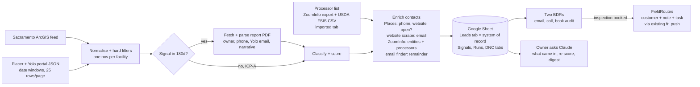

# Commercial Pest Lead Engine: county inspections and ZoomInfo to a BDR pipeline sheet

**Revision 2, 2026-09-08.** Supersedes revision 1 (2026-09-07). What changed and why:

- **Destination is a shared Google Sheet, not FieldRoutes.** The owner decided leads go to a sheet first; FieldRoutes gets a customer only when an inspection is booked (section 5). The FieldRoutes lead code built in phase 1 stays and becomes the handoff step.
- **Two full-time BDRs, email first then call.** That makes email addresses a hard requirement, and the county data mostly doesn't have them. Section 6 is now mostly about getting emails, and section 7 is a new operating model for the reps.
- **Placer and Yolo are in scope from the start**, not phase 2. Yolo is West Sacramento only; Placer excludes Auburn and the Tahoe basin (decided 2026-09-07).
- **Priority 1 is large food processing and storage facilities; priority 2 is one-time exclusion jobs at restaurants.** Processors are not in county inspection data at all (they are state licensed), so they need their own source from day one: ZoomInfo and the USDA meat and poultry establishment directory, both covered in section 6.3.
- **Sources in order: county inspections, then ZoomInfo when that runs dry.** The supply maths in section 7.4 says "dry" arrives in about six weeks, so the ZoomInfo pull is scheduled for week three rather than left open.

Status: phase B live and running (2026-09-08). Phase 1/A (Sacramento feed, scoring, PDF classification, FieldRoutes push) exists on this branch and is tested. Phase B (`myhd.py`: Placer/Yolo portal adapter; `sheet.py`: the Google Sheet destination) is built, tested (395 tests), and now live-validated end to end: a real `fr-leads run` against the owner's "Zest Commercial Leads" sheet added 40 real rows across Sacramento and Placer with zero errors (validation checklist item 1). A scheduled Railway service ("Lead Scraper" in the `serene-essence` project) runs it every weekday at 7am Pacific; it needs no FieldRoutes credentials at all since the sheet destination never touches FieldRoutes. Still open: same-day idempotency hasn't been re-run (checklist item 3), items 4-7 (Placer/Yolo dry-run over 5 days, Yolo PDF parse on 3 reports, new-signal flagging, DNC) are unrun; phases C (contacts/enrichment) and D (processor list) are design only, not built. Anything not verified is marked **unverified** and appears in the validation checklist (section 11).

## 1. Summary and recommendation

Build a lead engine whose output is one shared Google Sheet the two BDRs live in. The tool refreshes it on a schedule, appends new prospects, flags known ones when something new happens, fills in phone, email, owner and website, and never touches the columns the reps own. FieldRoutes becomes the system of record only at the moment a lead books an inspection; until then the sheet is the pipeline.

Three lists feed the sheet:

1. **Event lane** (county inspections): facilities with a recent vermin, closure or suspension inspection in Sacramento, Placer or West Sacramento. Small, urgent, and the only list where the rep can quote a dated fact. Call the day the row appears; the email is the follow-up.
2. **Territory lane** (county inspections): independent large markets, ethnic grocers, commissaries and bakeries with no violation. The audit-offer list. Email first, call two days later.
3. **Processor list** (ZoomInfo and USDA): food manufacturers, wholesale grocers, cold storage and distribution in the three counties. Priority 1 for revenue, longer cycle, different pitch (audit-ready pest program for third-party food-safety audits, not a "rodent audit").

Emails come from a stack, in order: the Yolo report PDF (has one), the business website found through Google Places, ZoomInfo for anything owned by an LLC or corporation and for every processor, and an email-finder service for what's left. Expect roughly half of independent restaurants and corner markets to have no findable email; those go straight to the call step. Large facilities will be much better covered.

Two BDRs can work a few hundred conversations a month. The county feeds produce a couple of new violation leads a day across the three counties and a few hundred good territory prospects in total, so the inspection source alone is exhausted in about six weeks. The ZoomInfo processor pull is therefore part of the initial build, not a fallback.

The owner's interaction with all of this is the sheet plus this chat. There is no terminal in the daily loop.

## 2. What the data actually contains

### 2.1 Primary source: Sacramento County ArcGIS feature service (CC0)

`https://services1.arcgis.com/5NARefyPVtAeuJPU/arcgis/rest/services/Food_Inspections/FeatureServer`

| Layer | Rows | Meaning |
| --- | --- | --- |
| 0 Facilities (points) | 6,211 | One row per `Facility_ID`, the facility's most recent inspection, with lat/lng (34 rows lack geometry) |
| 1 Inspection & Violation History (table) | 41,055 | One row per inspection per permit, 2023-09-09 to 2026-09-04 |

Fields on both: `Facility_ID` (e.g. `FA0001006`), `Facility_Name`, `Facility_Address` ("1016 10th St, Sacramento 95814-3502": street, city, zip+4, no state; 9 rows carry "CA, USA" noise, 1 lacks a zip), `Description` (permit type; the value `FOOD PREP ESTAB ` has a trailing space), `Inspection_Service`, `Inspection_Type`, `Inspection_Result`, `Inspection_Date` (epoch ms), `Inspection_Report` (PDF URL whose `pKey` is the inspection GUID), `Violation_Description` (comma-joined category names, each optionally suffixed "[Corrected at time of Inspection]"; 468 distinct combinations; null on 30,032 rows).

Query mechanics: standard ArcGIS REST (`where` SQL, `outFields`, `resultOffset`/`resultRecordCount` at 2,000, `outStatistics`/`groupByFieldsForStatistics`, `returnCountOnly`, `outSR=4326`). A full layer-0 pull is 4 requests. Freshness: data edited daily about 03:00 Pacific; newest inspection is about 3 days old on any given day.

Two quirks to design for: one facility can hold several permits (99 Ranch on Florin Rd has five: retail floor, bakery, dim sum station, seafood department, bakery kitchen), so `Facility_ID` is the lead key and permits collapse under it; and the same inspection GUID can appear on more than one layer-1 row, so inspections dedupe on `pKey`.

### 2.2 Facility types and the ICP

| County permit type | Count | ICP tier | Notes |
| --- | --- | --- | --- |
| RETAIL MARKET (15000+SQ.FT) | 147 | A | 99 Ranch, Bel Air, Costco, Smart Foodservice, La Superior; many are chains |
| RETAIL MARKET (6000-14999 SQ.FT.) | 51 | A | A&A Supermarket, Alibaba Halal, Babylon City Market, Corti Brothers, Del Valle |
| COMMISSARY | 42 | A | shared/cloud kitchens, caterers, school food service |
| RETAIL MARKET (LESS THAN 6000 SQ FT) | 700 | A- when the name says market/carniceria/seafood/bakery/halal etc. (about 167), else C (liquor and convenience) | |
| FOOD PREP ESTAB | 1,212 | A- when the name says bakery/panaderia/catering/commissary/kitchen/meat/seafood (about 76), else C | mostly coffee shops, 7-Elevens, delis |
| RESTAURANT WITH BAR | 488 | B | |
| RESTAURANT | 2,379 | B when a local multi-location operator, else C | |
| SATELLITE FOOD DISTRIBUTION FACILITY | 19 | B | mostly school/hospital satellites; two are supermarket warehouses |
| LICENSED HEALTH CARE FACILITY | 50 | B (low) | nursing homes; corporate procurement |
| SCHOOL/SENIOR MEAL, SCHOOL SATELLITE, MOBILE FOOD, BAR, FARMERS' MARKET, PRE-PACKAGED (<300 sq ft), PRODUCE/FARM STAND, VETERANS' ORG | 1,123 | excluded | not owner-accessible or no rodent exposure |

Name-keyword hits across layer 0: "market" 268, "supermarket" 49, "grocery" 29, bakery-type words about 85, fish/seafood 44, meat/carniceria 23, catering 27, "wholesale" 12 (almost all Costco). 402 base names (store number stripped) account for 1,880 facilities; a base name occurring 5 or more times is a reliable chain detector (catches Jimboy's 15, Pizza Guys 13).

Independent (non-chain) ICP-A facilities: 319, of which 174 are within 10 miles of the office and 132 within 10 to 20 miles. Chain ICP-A: 155.

### 2.3 Signal volumes (last 12 months, layer 1)

| Signal | Rows | Distinct facilities |
| --- | --- | --- |
| VERMIN AND ANIMAL CONTAMINATION category | 273 | 165 (98 restaurants, 21 food prep, 18 small markets, 11 restaurant-with-bar, 2 commissaries, 1 large market, rest excluded types) |
| Result CLOSED | 210 | |
| Result SUSPENSION OF PERMIT TO OPERATE | 36 | |
| Result CRITICAL VIOLATIONS | 275 | |
| Result CONDITIONAL PASS | 712 | |
| 2+ vermin-flagged inspections in 24 months | | 85 (e.g. GOLDSTAR SUPERMARKET 4, LA SUPERIOR #2 4, LA SUPERIOR SUPERMERCADOS 3, VALERIO'S TROPICAL BAKE SHOP 3) |
| Vermin or closure event in an A/A-/B facility | | about 38 |
| New A/A-/B signal facilities per day (last 90 days) | | under 1 |

### 2.4 The inspection report PDF

URL pattern: `https://inspections.myhealthdepartment.com/sacramento/print/?task=getPrintable&path=sacramento&pKey=<GUID>`. 150 to 900 KB, 3 to 6 pages, needs a browser User-Agent, has a real text layer (pypdf extracts it).

Every page repeats a header: `Owners Name<OWNER>Est Name<NAME>`, `City<city>Address<street> Zip<zip> Phone<phone>`, `FA<FacilityID> Permit ID<PR…> Purpose<…>`, `Prog Identifier<department> - PE: <code> CT: <tract>`. Verified examples: ("HAROON KHAN", "BUD'S BUFFET", "(510) 376-3395"), ("J-285 INC", "KFC/ A&W #181", "(916) 525-3600"), ("KHP SACRAMENTO LLC", "SEAPOT", phone blank). Across seven sampled reports the owner was a person in three and an entity in four; a phone was present in six.

The body is numbered violation blocks: category heading, then `Observations:` (the inspector's narrative), then `Code Description:` (CalCode boilerplate that itself contains the words vermin, rodents and insects and must be stripped before keyword matching). Verified narratives: NATOMAS FOOD & LIQUOR 2026-09-02, rodent droppings, no pest-control invoice on site; SEAPOT 2026-09-01 and CURRIES & BIRYANIS 2026-08-29, German cockroach closures; KFC/A&W 2026-08-31, one cockroach and a fly.

### 2.5 The portal's own JSON API (secondary for Sacramento, primary for Placer and Yolo)

`POST https://inspections.myhealthdepartment.com/` with a JSON body `{"task":"searchInspections","data":{"path":"sacramento","programName":"","filters":{},"start":0,"count":20,"searchStr":"…","lat":0,"lng":0,"sort":null}}` returns inspection rows with `permitID`, `progIdent` (department label such as "RETAIL FLOOR/WAREHOUSE/MEAT/PRODUCE"), `permitType`, and split address fields. It worked without the captcha in testing but the page code has a captcha path, and the site blocks bots. For Sacramento keep it as an optional "closures today" check, one request per run at most. For Placer and Yolo it is the only bulk source (2.6).

### 2.6 Placer and Yolo counties (verified 2026-09-07)

Both counties publish on the same platform, each under its own path and with its own field names and permit-type vocabulary. Neither has an open-data feed (ArcGIS Online and Placer's open-data hub were searched); Yolo's own county website blocks non-browser clients, and its separate "restaurant inspection report search" page is a different system covering about 700 fixed facilities.

| | Placer County | Yolo County |
| --- | --- | --- |
| Portal path (`path` in the JSON call) | `pchd` (record `nick` "cpch") | `yolocountyeh` (record `nick` "ycc") |
| Search call | same `searchInspections` POST; **25 rows per request maximum** (larger `count` is ignored), `start` pages; filters `date` ("YYYY-MM-DD to YYYY-MM-DD") and `purpose` verified working | same mechanics and cap; `date` filter verified |
| Volume (2026-08-24 to 09-07) | 208 inspections, about 20 per working day across all programs (Retail Food, pools, body art, mobile) | 78 inspections, about 8 per working day (Retail Food plus pools) |
| Row fields beyond Sacramento's | `purpose` (Routine / Follow-up / Complaint), `InspectionOutcome` (Green / Yellow / Red Placard; blank on non-food programs), `comments` (inspector narrative inline), `permitName` with the PR permit number | `INSP_PURPOSEID` (Routine / Follow-up), `comments` inline, `StartTime`; no outcome field (`score` null) |
| Pest evidence in the row | yes: 6 of 208 rows mention rodents, droppings, cockroaches, ants or "closure due to pests" (e.g. SPROUTS #428 Lincoln complaint alleging rodent activity; AZAYAKA Roseville closure with rodent droppings; CB'S BISTRO Carnelian Bay, rodent droppings and no pest contract) | yes: narrative in `comments`; "conditional placard" language appears |
| Permit types (ICP mapping) | `Market - With Food Prep Equal To Or > 5000 Sq Ft` and `Market - No Food Prep Equal To Or > 5000 Sq Ft` (A); `Market … >500 - 5000 Sq Ft` (A- with market keywords, else C); `Market - No Food Prep < 500 Sq Ft` (excluded); `Restaurant: 100 Or More Seats` (B); `Restaurant: 50 - 99 Seats` (B/C); `Restaurant: 0 - 49 Seats` (C); `School Cafeteria`, `Mobile Food Facility`, `Pool/Spa`, `Body Art` (excluded) | `Retail Food Markets 5,000+ square feet, RC1/RC2` (A); `Retail Food Markets 2,000-4,999 square feet` (A-); `Bakery …` (A); `CATERING - YEAR PERMIT` (A-); `Retail Food Markets less than 2,000 square feet` (C unless keyword); `Restaurant 150+ seats` and `50-149 seats` (B); `26-49` and `0-25 seats` (C); `School / Institutional … Satellite`, pools, temporary permits, `EDIBLE FOOD RECOVERY AUDIT FEE` (excluded). RC1/RC2/RC3 is the county's risk category; RC3 is the highest-risk food handling |
| Cities in scope | **Roseville, Rocklin, Lincoln, Granite Bay and Loomis only** (Zest regions 1, 7, 11), decided by the owner 2026-09-07. Auburn, Foresthill, Colfax and the Tahoe basin (Kings Beach, Tahoe City, Carnelian Bay, Olympic Valley, zips 961xx) are out; the adapter keeps Placer rows by zip allowlist (95661 95678 95747 95746 95677 95765 95648 95650) | **West Sacramento only** (zips 95605, 95691; region 6), decided by the owner 2026-09-07. Davis, Woodland, Winters and the rural towns are out of scope for now. The portal cannot filter by city, so the adapter pulls Yolo's small date window in full (about 8 rows a day) and keeps only West Sacramento rows client-side |
| Report PDF | different template: header has Facility Name, Facility ID `FA…`, Record ID `PR…`, Program Element, Inspector, "Received By" (person on site). **No owner name or phone.** Body is per-violation blocks: title, "Violation Txt", "Violation Code", "Status: OUT", "Inspector Comments" | single page: Establishment Name, address, **Permit Holder**, **Email address**, **Phone** (blank in the sample), Facility ID `FA…`, PR ID, purpose, **MAJ** (major-violation count), Risk Category, "Notes / COMMENTS", the specialist's name, and the person-in-charge email |
| Facility key | `FA…` Facility ID in the PDF; `permitID` GUID and `permitName` PR number in the row (several permits can share a facility, same as Sacramento) | `FA…` in the PDF; `permitID` GUID in the row |

What this means for the design: the portal adapter pulls each county by date window (last 45 days daily, 180 days on backfill), pages at 25 rows with a 2-second gap (Placer backfill about 100 requests, Yolo about 40, daily runs 1 to 3 requests each), keeps only food programs, and reads the pest signal from `comments` first, opening the PDF only when the narrative is empty or a placard/closure needs the detail. Placer leads need Google Places (phase 3) or ZoomInfo for a phone number; Yolo leads often come with an email. The facility identity for `customerLink` is the county's own `FA…` ID read from the PDF header, with the `permitID` GUID as the interim key until a PDF has been opened.

## 3. Ideal-customer filter and lead scoring

### 3.1 Hard filters (applied before scoring)

1. Drop excluded permit types (table in 2.2) unless the facility also holds a non-excluded permit.
2. Drop facilities whose latest inspection is more than 540 days old (likely closed).
3. Drop facilities more than 35 miles from the office (Delta and Lodi-side zips 95641, 95690, 95615, 94571, 95240).
4. Park (do not push, keep in state with lane `chain`) national and big-box chains: a maintained regex list (Costco, Safeway, Raley's/Bel Air/Nob Hill, Save Mart/FoodMaxx, WinCo, Grocery Outlet, Smart & Final, Trader Joe's, Whole Foods, Sprouts, Walmart, Target, 7-Eleven, the QSR names) plus any base name occurring 5 or more times in layer 0. Regional ethnic operators (99 Ranch, La Superior, Seafood City, Viva) are a named exception the owner decides on.
5. Drop signals whose inspection type is ATTEMPTED.

### 3.2 Score = (icp_fit + pest_signal + recency + reachability) x geo, max 100

**icp_fit (0-40)** by best permit under the facility: 15000+ market 30; 6000-14999 market 30; commissary 28; satellite distribution 25; bakery 22; small market 12, or 24 with a market keyword in the name; restaurant with bar 14; restaurant 12; food prep 8, or 18 with a bakery/catering/kitchen/meat/seafood keyword; health-care facility 12. Add +5 per extra permit (cap +10), +6 for meat/seafood words, +4 for bakery words, +3 when the PDF department string mentions warehouse/meat/produce, +4 for a local multi-location operator (base name appears 2 to 4 times and is not on the chain list).

**pest_signal (0-40)** from the strongest inspection in 24 months: rodent confirmed in the narrative 40; cockroach confirmed 36 (owner decision 2026-09-07: cockroach work is wanted; the small gap only orders rodent cases first when everything else is equal); mixed rodent and cockroach 40; vermin with unavailable or unparsed PDF ("vermin_unclassified") 22; flies, ants or other insects only 20; closure or suspension for non-vermin reasons 8; critical violations or conditional pass without vermin 4. Modifiers: +8 when that inspection's result was CLOSED or SUSPENSION (quotable), +6 per additional vermin-flagged inspection in 24 months (cap +12), +6 when the narrative says no pest-control provider or invoice was found, +3 for live evidence versus dead-only, 0 extra when an existing provider is mentioned (tagged for a displacement pitch).

**recency (0-10)** of that inspection: 7 days or less 10; 30 days 8; 90 days 5; 180 days 2; older 0.

**reachability (0-10)**: phone in the PDF header +5; owner is a person rather than an entity +3; Places returned a phone or website +2.

**geo multiplier** by distance from 6948 West 2nd St, Rio Linda: 10 miles or less 1.00; 10 to 20 0.90; 20 to 30 0.75; over 30 0.50; unmapped region a further -0.05.

**Tiers**: Hot 70+, Warm 50 to 69, Cool 30 to 49, Park under 30. One cap: vermin_unclassified stays at 65 or below until the PDF is parsed (retried on the next three runs), so an unread report cannot outrank a confirmed infestation. There is no cap on cockroach leads; the task text names the pest so the rep opens with the right offer (rodent audit versus cockroach clean-out and exclusion).

Worked examples from live data: an ethnic 15000+ supermarket with four vermin flags in 24 months and a rodent narrative scores 85 to 95 (Hot). NATOMAS FOOD & LIQUOR (small market, no keyword, rodent narrative, no provider, phone present, 9 miles) scores 65 (Warm); the owner can lift such cases with a "confirmed infestation at any food retail +10" rule, which is recommended. SEAPOT (restaurant with bar, German cockroach closure on 2026-09-01, live evidence, no phone, 7 miles) scores 14 + 47 + 8 + 0 = 69 (Warm, one point short of Hot; the +10 rule makes it Hot). CURRIES & BIRYANIS (Folsom restaurant, cockroach closure, phone present, inspector recommended sealing gaps) scores 12 + 47 + 8 + 5 = 72 (Hot).

### 3.3 Pest classification (rodent, cockroach, other)

The classifier's job is to name the pest for the pitch and the task text, catch "no provider" and "live evidence" phrases, and pull the quotable line.

Apply only to the Observations text of blocks whose category is VERMIN AND ANIMAL CONTAMINATION, after deleting everything from `Code Description:` to the next numbered heading and any sentence containing " shall " (CalCode language).

- rodent: `\b(rodents?|rats?|mice|mouse|gnaw(ed|ing|s)?|burrows?|rub marks|snap traps?|rodent (bait|trap|activity)|urine (stains?|odor))\b`, or `\bdroppings\b` when not preceded within three words by roach/cockroach/insect/fly/bird/pigeon.
- cockroach: `\b(cockroach\w*|roach\w*|nymphs?|egg cases?|ootheca)\b`.
- flies/ants/other: `\b(fly|flies|fruit fl\w+|drain fl\w+|gnats?|ants?|maggots?|pupae)\b`.
- no_pco: "no pest control", "invoice could not be located", "no service records"; has_pco: "pest control company", "serviced by", "invoice from".
- live_evidence: live, adult, activity, fresh, nesting.

Mixed rodent and cockroach is labelled "rodent + cockroach". Every lead note carries the raw 200-character quote and the report URL so the rep can verify in ten seconds; misclassifications reported through task completion notes feed the phase-4 re-weighting. Unit tests use the seven PDF texts already extracted during planning as fixtures.

### 3.4 County permit-type mapping

Each county has its own vocabulary, so `icp_fit` is computed from a per-county mapping table (Sacramento in 2.2, Placer and Yolo in 2.6) that normalises to the same internal classes: large market (30), mid market (30), commissary/catering/bakery (22 to 28), small market (12, or 24 with a market keyword), large restaurant (14), restaurant (12), excluded. Placer's placard colour and Yolo's major-violation count feed `pest_signal` the same way Sacramento's `Inspection_Result` does: Red Placard or closure 8 extra, Yellow Placard or conditional placard 4.

### 3.5 Two lanes (plus a third, the processor list, that is not scored from county data)

- **Event lane**: facilities with an unhandled vermin or closure/suspension inspection within 180 days. Pushed first, Hot then Warm; Cool goes to the backlog.
- **Territory lane**: independent ICP-A facilities (icp_fit 24 or more) with no signal, ordered by distance then by days since last inspection ascending (recently inspected means confirmed operating). These are audit-offer prospects, not complaints, and the row says so.
- **Processor list** (revision 2): food manufacturers, wholesale grocers and cold-storage warehouses from ZoomInfo and the USDA directory (section 6.3). They never appear in county inspection data, carry no pest signal, and are ranked by size and distance rather than by this score. They sit in the same sheet with lane `processor` so the reps work one list.

## 4. Architecture (revision 2)

The phase-1 package `src/fr_mcp/leads/` stays. What changes is the destination and the sources on either side of it.

**Components.** `sources/sacemd.py` (exists as `arcgis.py`), `sources/myhd.py` (new: portal JSON adapter for `pchd` and `yolocountyeh` with per-county field and permit-type maps, 25-row paging, date windows, circuit breaker on 403 or captcha), `reports.py` (exists; add the Yolo and Placer header layouts), `classify.py` and `score.py` (exist, unchanged), `enrich/places.py`, `enrich/website.py`, `enrich/zoominfo.py` (new), `sheet.py` (new: read the Leads tab, dedupe, append, update tool-owned columns only), `fr_push.py` (exists; used by the handoff), `cli.py` (exists; `run` gains `--destination sheet|fieldroutes`, default `sheet`).

**State.** The sheet is the state store. The tool reads the Leads tab's key column at the start of every run to know what exists, and the Signals tab to know which inspection GUIDs it has already recorded. No SQLite, no volume; a lost cache directory just means re-fetching a few PDFs. The PDF cache stays on disk for politeness.

**Runtime.** A Railway cron service from the same Docker image (or a GitHub Actions schedule, the owner's choice), weekday mornings. Env: the Google service-account JSON (one secret), the sheet ID, `GOOGLE_PLACES_KEY`, the county paths, the caps. FieldRoutes credentials are only needed once the handoff (5.3) is automated.

**Keys.** Sacramento: `SACEMD:<Facility_ID>` from the feed. Yolo: `YOLO:<FA id>` from the PDF header (fetched anyway for the email). Placer: `PCHD:<PR permit number>` parsed from the row's `permitName` (the FA id only exists in a PDF that carries nothing else useful, so don't fetch it just for the key). Processors: `ZI:<ZoomInfo company id>` or `FSIS:<establishment number>`. One facility can hold several permits; the county rows collapse on facility, the Placer rows collapse on facility name plus address.

## 5. Destinations

### 5.1 The Google Sheet (system of record for prospects)

Tabs:

- **Leads**, one row per facility, the only tab the reps edit.
- **Signals**, one row per inspection event the tool has seen (key, GUID, date, result, pest, quote, report URL). Append-only; this is the audit trail and the idempotency record.
- **Runs**, one row per tool run (when, rows added, rows flagged, enrichment counts, quota used, errors).
- **DNC**, keys or phone numbers or emails the reps mark do-not-contact. The tool never re-flags a key on this tab and never enriches it further.

Leads tab columns the tool owns (never edited by reps):

| Column | Source |
| --- | --- |
| key, county, lane, tier, score | pipeline |
| facility, permit types, address, city, zip, region, distance (mi) | county feed |
| pest, evidence quote, signal date, signal result, report link, prior vermin flags (24 mo), new-signal flag, signal count | PDF + feed |
| owner name, owner type (person / entity) | Sacramento PDF, Yolo PDF, ZoomInfo |
| phone, phone source | Sacramento PDF, Google Places, ZoomInfo |
| email, email source, email confidence | Yolo PDF, website, ZoomInfo, email finder |
| website, business status (open / permanently closed), first seen, last updated | Google Places, tool |

Columns the reps own (never written by the tool): rep, status, last touch date, next step date, touch count, notes, inspection date, outcome, FieldRoutes customer ID.

Status vocabulary (a dropdown): new, emailed, called, connected, inspection booked, inspected, won recurring, won one-time, lost, do not contact. Two views per rep (filter on the rep column) plus a manager view sorted by tier and next step date.

Update rules: a new facility appends a row with status `new`; a known facility with a new inspection GUID gets its evidence columns updated, the new-signal flag set and the signal count incremented, and nothing else changes; a facility on the DNC tab is skipped entirely; a row whose business status comes back permanently closed is marked, not deleted. The tool writes in one batch at the end of a run, so a crashed run leaves the sheet untouched.

Why direct writes rather than Zapier: the tool has to read the sheet to dedupe and to honour DNC, which a Zapier "add row" step cannot give it. Setup is a Google Cloud service account (one JSON key stored as a secret) and sharing the sheet with that account's email, about ten minutes once.

### 5.2 Excel

If the owner prefers a file, the same writer produces an `.xlsx` with the same tabs, but then dedupe across runs depends on the tool keeping its own copy, and rep edits live in a file nobody else can see. Recommended only as an export, not as the pipeline.

### 5.3 FieldRoutes at the handoff

When a rep sets status to `inspection booked`, a customer is created in FieldRoutes exactly as Appendix A describes (inactive, commercial, the new "Health Dept Inspections" or "Commercial Prospecting" source, `customerLink` = the sheet key, a note with the evidence, a task for the rep), then the audit appointment is scheduled. First version: the rep does this by hand in FieldRoutes and pastes the customer ID into the sheet. Second version: the tool sees the status change on its next run and does the create itself through `fr_push`, which already implements the dedupe and the writes, then fills the customer ID column. The lead subscription (`active -3`) and the ZoomInfo contacts as `additionalContact` rows come with that second version.

## 6. Contacts: phone, email, owner, website

### 6.1 What the county sources give us

| County | Owner | Phone | Email | Narrative |
| --- | --- | --- | --- | --- |
| Sacramento | yes (PDF header, person or entity) | usually (PDF header) | no | PDF |
| Placer | no | no | no | inline `comments` field, no PDF needed |
| Yolo (West Sacramento) | business name only | sometimes (PDF) | yes, permit holder and person in charge (PDF) | inline `comments` and PDF |

### 6.2 The enrichment stack, in order

1. **Yolo report email** when present. Free. Store source `yolo_pdf`.
2. **Google Places API (New)**, Text Search on name plus address, field mask for phone, website, business status, rating count. Gives Placer its phone numbers, everyone a website to scrape, and a permanently-closed flag that keeps dead businesses off the reps' lists. Pro-tier fields, about 5,000 free calls a month, which covers the initial pool of roughly 1,500 facilities across the three counties and the trickle after (**unverified** in this sandbox; one live call to confirm field names and free-tier accounting).
3. **Website scrape** for the email: fetch the home page and an obvious contact page, take `mailto:` links and plain addresses, prefer role addresses on the business's own domain, discard webmail-hosted junk from page templates. Polite (one request every two seconds, one attempt per site). Store source `website` with a confidence of medium.
4. **ZoomInfo** for entity-owned leads (LLC, INC, CORP owners), every processor, and any local multi-location operator: company enrich, contact search by title (owner, general manager, facilities, quality or plant manager), contact enrich for the top one or two. Credit rules and caps in 6.4. Store source `zoominfo`, confidence high.
5. **Email finder** (Apollo, Hunter or similar; owner picks the vendor) by domain for rows that have a website but no email after step 3. Pay per credit; cap at a small daily number. Store source `finder`, confidence per the vendor's score.
6. **Manual** for the rep to fill; source `manual`.

Expected coverage after the stack (**unverified**, to be measured on the first 100 rows, section 11): most large markets, commissaries and processors will have an email; independent restaurants and corner markets will land near half. The sheet's `email source` column is what tells a rep how much to trust an address.

### 6.3 The processor list (priority 1, not in county data)

Food manufacturing, wholesale grocery and cold storage are licensed by the state's Food and Drug Branch, which publishes no list. Two sources do:

- **ZoomInfo company search**: industries food production and manufacturing, grocery and related product wholesalers, refrigerated warehousing and storage; location in Sacramento, Placer or Yolo County; employee count 20 and up (owner to tune). Export to the sheet's import tab; the tool dedupes by ZoomInfo company ID, scores by size band and distance, and enriches contacts by title. This is where the two BDRs' priority-1 pipeline comes from, so it is built in the first phase, not held in reserve.
- **USDA FSIS Meat, Poultry and Egg Product Inspection Directory**: a public CSV, updated weekly, of every federally inspected meat, poultry and egg plant with establishment number and address (https://www.fsis.usda.gov/inspection/establishments/meat-poultry-and-egg-product-inspection-directory). Filter to the three counties; these are the highest-value rodent-exposure sites in the region and they all carry third-party audit obligations.

One geography note: much of the region's food processing sits in Woodland, which the owner excluded for the county-inspection lists. Recommendation: keep Woodland out of the restaurant and market lists as decided, but include it for processors only, since that is the segment the owner ranked first.

### 6.4 ZoomInfo as an enrichment source (decided 2026-09-07: yes, with limits)

ZoomInfo can enrich these leads, but its coverage is uneven for this market: strong for chains, franchise operators, food-service groups, distributors and any business with a website and staff on LinkedIn; thin for single-location taquerias and corner markets, where the county PDF header (owner name and cell) is usually the better source anyway. So the plan uses ZoomInfo selectively and measures its hit rate before spending credits broadly.

**Two ways in.** (a) The ZoomInfo app in Zapier, which the owner already uses: no code, triggered by the digest webhook, and the same Zap writes the result back to FieldRoutes. (b) ZoomInfo's REST API called from the scraper directly, which is cleaner but needs API credentials on the ZoomInfo account (availability depends on the plan; **unverified**). Start with (a); move to (b) only if the Zapier path proves too slow or too many Zap tasks.

**Credit rules (from ZoomInfo's documentation).** "Enrich Company" and "Enrich Contact" consume one credit per successful match unless the record is already under management; "Search Contacts" is free and only counts against request limits. So the Zap searches first and enriches only what it will use.

**Which leads.** Hot and Warm leads whose county-record owner is an entity (LLC, INC, CORP, LP) or whose base name is a local multi-location operator, plus every parked chain lead the owner chooses to work as a corporate play. Not person-owned single locations (the PDF already names them). Cap: 5 enrichments per day, adjustable.

**Match keys we can supply.** Company name, street address, city, zip, the phone from the PDF header when present, the owner entity name, and the website from Google Places (phase 3). Matching on name plus address is far more reliable than name alone for restaurants, so the Zap passes all of them.

**What to pull.** Company: legal name, website, domain, employee count, revenue band, parent or franchisor, headquarters address, main phone. Contacts: Search Contacts filtered to seniority Owner, Partner, C-level, General Manager, Director of Operations or Facilities, then Enrich Contact on the top one or two: name, title, direct phone, mobile if present, email, LinkedIn URL.

**Where it lands in FieldRoutes.** Each decision-maker becomes a contact column on the lead's sheet row (and, after the handoff, an `additionalContact/create` row on the FieldRoutes customer) (required: `customerID` and `additionalContactTypeID`, an office-configured contact type the owner creates or picks in the UI; fields `fname`, `lname`, `companyName`, `phone`, `phone2`, `email`, `contactType`, `addedBy`; reminders forced to 0), so the rep sees a proper contact card instead of a note. Company facts (website, employee count, parent, HQ) go into one note prefixed "ZoomInfo:" and the website into the note only (the customer record has no website field). Blank `email`/`phone2` on the customer are filled via `customer/update`; existing values are never overwritten. A `zoominfo_enriched_at` column in the state store prevents re-enriching the same facility within 180 days.

**Cost and volume.** At 5 per day this is at most about 100 credits a month and roughly 10 Zapier tasks per lead (webhook, filter, search, enrich, two FieldRoutes writes, logging). FieldRoutes writes from the Zap count against the shared 3,000 per day; two to three per enriched lead is negligible.

**Compliance.** ZoomInfo contact data is business contact data under its terms; direct dials are still for manual calls only, and any contact who asks not to be called is flagged the same way as the facility.

## 7. Operating model for two BDRs

### 7.1 Segments and sequences

| Segment | Where it comes from | First touch | Cadence | Pitch |
| --- | --- | --- | --- | --- |
| Event lane (recent vermin, closure, suspension) | county feeds, daily | call the day the row appears; email the same day as follow-up | 4 touches in 10 days, then monthly | free Rodent Risk Audit (or cockroach clean-out and exclusion when the pest is roaches), reinspection readiness |
| Territory lane (large markets, grocers, commissaries, bakeries, no violation) | county feeds, weekly refresh | email day 0, call day 2 | 4 touches in 3 weeks, then quarterly | free Rodent Risk Audit, route density means a good price |
| Processors (manufacturers, wholesale, cold storage) | ZoomInfo and USDA, monthly refresh | email to the plant, facilities or QA manager, call day 3 | 6 touches in 5 weeks | audit-ready pest program: documentation, monitoring maps, trend reports for SQF/BRC/AIB audits; site walk instead of a free audit |
| Restaurants (priority 2) | county feeds, event lane only | as event lane | as event lane | one-time exclusion job, upsell to recurring after |

The existing call script is the base; the email for each segment is a different one-paragraph note. Recommendation, for the owner to confirm: outreach does not cite the county finding. The violation decides who and when; the message leads with the audit and with being local. Quoting a closure back to an owner reads as surveillance.

### 7.2 A day in the sheet

Morning: the tool has already run. Each rep opens their view, works the `new` rows top down (event lane first, then territory, then processors), sets status and next-step date on every row touched, and logs a two-line note. Replies and connects move the row forward; a booked audit sets `inspection booked` and triggers the FieldRoutes handoff. Do-not-contact requests go on the DNC tab the same day.

Weekly: the owner reviews the Runs tab and the five numbers below, decides on weight changes (for example, lowering cockroach relative to rodent), and asks Claude for the digest.

### 7.3 The audit is the product

The free Rodent Risk Audit closes the deal, so standardise it before the first one: a fixed checklist matching Phase 1 of the division plan (exterior and perimeter, doors and docks, trash and food storage, evidence and harborage, existing devices), photos of every entry point, and a one-page findings sheet with critical, potential and acceptable areas and a price for exclusion and for the recurring program, handed over on site. Inspection-to-close is the number the division lives on; record it from the first audit in the `outcome` column.

### 7.4 Capacity and supply (assumptions, to be replaced with real numbers after month one)

| | Per rep per day | Two reps per month |
| --- | --- | --- |
| Dials | 60 to 80 | about 2,500 |
| Personalised emails | 25 to 35 | about 1,200 |
| Conversations | 6 to 10 | about 300 |
| Audits booked (at 1 in 8 conversations) | | about 35 |

| Supply | Initial pool | Ongoing |
| --- | --- | --- |
| Event lane, three counties, all eligible types | about 60 | 10 to 15 a week |
| Territory lane, Sacramento | about 275 independent ICP-A | a few a week |
| Territory lane, Placer (Roseville, Rocklin, Lincoln, Granite Bay, Loomis) | **unverified**, likely 100 to 150 | a few a week |
| Territory lane, West Sacramento | **unverified**, likely 20 to 40 | rare |
| Processors, three counties | **unverified**, likely 80 to 150 companies | monthly refresh |

At the rates above the county lists are worked through in about six weeks. That is why the ZoomInfo processor pull is in the first build, and why the territory lane is refreshed rather than treated as a one-time backlog.

### 7.5 Five numbers, weekly, by lane and county

Rows worked, replies, connects, audits booked, audits won (split recurring and one-time). The Runs tab and the status column carry all of it; a pivot on the sheet is enough until the CRM move.

### 7.6 Email setup, deliverability and compliance (decided 2026-09-08: personalised one-to-one emails, not bulk sequences)

The reps write each email by hand, one prospect at a time, at a few dozen a day. That is ordinary business correspondence, not bulk mail, so the heavy cold-email infrastructure (separate sending domain, warm-up services, a sequencer) is not needed on day one. What is needed:

- **One mailbox per rep on the company's own domain** (Google Workspace, e.g. firstname@zestlawnpest.com), not the shared main business inbox. Replies must land with the person who wrote, the main inbox must stay clean for quotes and customers, and a shared inbox makes it impossible to tell who owns a thread. If the business email is a consumer @gmail.com address, move to Workspace on the company domain first; cold outreach from @gmail.com reads as spam and has lower send limits.
- **Authentication on the domain** (SPF, DKIM, DMARC), which most Workspace domains already have; confirm rather than assume.
- **Volume discipline**: new mailboxes ramp over two weeks; stay well under Workspace's daily limits; a bounce or spam complaint is a signal to slow down, not push through.
- **Every email**: a real signature with the company's physical address and phone, a plain opt-out sentence, and the DNC tab updated the same day anyone asks not to be contacted.
- **Reply tracking**: a Gmail label per rep plus the sheet's status column is enough at this volume. A shared alias (e.g. commercial@) in CC gives the owner visibility without owning the thread.

If the reps later move to automated multi-touch sequences, revisit this: a separate sending domain and a sequencing tool become worth it at that point (section 7.7). Calls are business-to-business and manually dialled; no auto-texting to cell numbers.

### 7.7 When the sheet stops being enough

With two reps running multi-touch cadences, the sheet will hurt within a couple of months: no sequencing, no reply capture, no per-rep reporting. At that point the pipeline moves to a lightweight sales CRM in front of FieldRoutes, the sheet columns map onto it one for one, and the tool writes to the CRM's API instead of the sheet (the writer is one module). FieldRoutes stays the system of record for customers, as discussed with the owner on 2026-09-07.

## 8. Operations and safety

- **Politeness**: ArcGIS is open data; the portal (Placer, Yolo, PDFs) gets a browser User-Agent, one request every two seconds, 25-row pages, date-window pulls only, results cached by inspection GUID, and a circuit breaker that stops all portal calls for the rest of the run on a 403, captcha page or non-JSON response. Website scrapes get one attempt per site with the same spacing. Never enumerate a whole portal.
- **Sheet safety**: batch write at the end of a run; tool-owned and rep-owned columns are disjoint and enforced by column name, not position; every run logs to the Runs tab; a `--dry-run` prints the rows it would add and change without writing; the DNC tab wins over everything.
- **Caps**: new rows per run (default 40 across lanes), Places calls per run, email-finder credits per day, ZoomInfo enrichments per day (5). A cap hit is logged, never silent.
- **Feed drift**: field-name assertions on the full-field ArcGIS pulls and on the portal row shape; a run that fails them writes nothing.
- **Observability**: JSON lines to stdout, a summary line, the Runs tab, and a "no run row today" watchdog in Zapier that pings Slack.
- **Compliance guardrails**: public records; business-to-business outreach; manual dialling; inspection detail stays internal (the sheet is internal); never imply affiliation with the county; DNC honoured by key, phone and email.
- **FieldRoutes**: nothing is written there until the handoff; when it is, the same `FR_WRITES`, allowlist and quota guards apply as everywhere else in this repo.

## 9. How the owner and the reps interact with the tool

- **Reps**: the sheet, and nothing else. Their views, their columns, the DNC tab.
- **Owner**: the sheet's manager view, plus this chat. Claude can read the sheet through the Google Drive connector already attached to this workspace to answer "what came in this week", "which processors have no email yet", "show me every Folsom lead with a rodent finding". Changing weights, caps or the chain list is a config change I make on request. Later, two MCP tools (`lead_preview`, `lead_import`, as in revision 1) let Claude run the pipeline on demand; not needed while the cron and the sheet do the job.
- **Engineer (me, in a coding session)**: the `fr-leads` command, which already exists. `preview` to look, `run --dry-run` to rehearse, `run` for the scheduled job, `push --facility` for one-off checks.

## 10. Delivery phases (revised)

| Phase | Deliverables | Effort | Exit criteria |
| --- | --- | --- | --- |
| A (done) | Sacramento feed adapter, ICP mapping, hard filters, PDF fetch and parse, pest classification, scoring, two lanes, FieldRoutes push with dedupe, `fr-leads` CLI, 110 tests | done | on this branch |
| B. Sheet destination and the other two counties | `sheet.py` (service account, read keys and DNC, batch append and update, Signals and Runs tabs), `--destination sheet`, Placer and Yolo adapters with per-county maps and the circuit breaker, Yolo PDF header parser, keys per county, a first live run into the owner's sheet in dry-run then for real | 4 days | the owner's sheet fills with three counties' rows; a second run adds nothing; a DNC row is skipped; a new inspection on a known row flags it without touching rep columns |
| C. Contacts | Google Places (phone, website, closed flag), website email scrape, email-finder step, ZoomInfo via the existing Zapier app for entities, source and confidence columns, per-run caps, coverage report in the Runs tab | 3 days | email or phone present on at least 80% of event-lane and territory rows; coverage by source reported |
| D. Processor list | ZoomInfo export template and import tab, USDA FSIS CSV pull filtered to the three counties (Woodland included for this segment if the owner agrees), size and distance ranking, contact enrichment by title, lane `processor` in the same sheet | 2 days | at least 80 processor companies with a named contact; reps can start the processor sequence |
| E. Schedule and handoff | Railway cron (or Actions) weekday mornings; the `inspection booked` handoff creating the FieldRoutes customer, note and task through the existing push code and filling the customer ID column; Slack digest via Zapier; watchdog | 2 days | runs unattended for a week; one booked audit lands in FieldRoutes correctly |
| F. Later | CRM front end, MCP tools, lead subscriptions, calibration from outcomes, other counties | as needed | |

Phases B, C and D can overlap; C and D are where the BDRs' week-one and week-three lists come from.

## 11. Validation checklist (in order)

1. **Passed live 2026-09-08.** Google service account created; sheet shared with its email; `fr-leads run` (all three counties, default 40-row cap) against the real "Zest Commercial Leads" sheet. Result: 40 rows added (event lane Hot/Warm/Cool from Sacramento plus one Placer event-lane row, `PCHD:PR0007074`), 274 more pushable candidates correctly held back by the cap, 0 errors, every tool-owned column filled (score/tier/pest/address/etc.), every rep-owned column blank, `status` = `new`. The Signals tab got one row per event-lane candidate (30 rows) and the Runs tab recorded the run (`rows added: 40, skipped cap: 274`). No Yolo rows this run -- plausibly correct given its ~8/day volume and the 45-day window, not re-checked against a manual portal look.
2. First real write, Sacramento only, capped at 40 rows. Pass: the rows appear with every tool-owned column filled where data exists; rep columns empty. (Superseded by item 1 above, which covered this across all three counties in one pass.)
3. Idempotency: re-run the same day. Pass: zero rows added; the Runs tab shows the run. **Not yet run** -- item 1's run hasn't been repeated same-day.
4. Placer and Yolo pulls in dry-run for a 45-day window for five consecutive days. Pass: no 403 or captcha; counts match a manual look at the portal for two dates; Placer rows are only the five in-scope cities; Yolo rows are only West Sacramento.
5. Yolo PDF parse on three reports. Pass: permit holder email extracted; FA id becomes the key.
6. New-signal flagging: seed a known key with an older GUID, run against a feed containing a newer one. Pass: evidence columns update, flag set, rep columns untouched.
7. DNC: add a key to the DNC tab, run. Pass: skipped, logged.
8. Google Places: one live call for a known facility. Pass: phone matches the PDF, website present, field names as expected, free-tier accounting visible in the console.
9. Enrichment coverage on the first 100 rows: percentage with an email and a phone, by source. This number sets the reps' expectations and decides whether the email finder is worth its credits.
10. ZoomInfo pilot: twenty rows by hand (ten entity-owned independents, five multi-location operators, five processors). Pass: half or better of the independents match; all processors match with a named plant, facilities or quality contact.
11. USDA FSIS CSV filtered to the three counties. Pass: a list of plants with addresses the owner recognises.
12. Sending domain authenticated and warmed; a test sequence to internal addresses. Pass: lands in the inbox, opt-out works.
13. Handoff: one `inspection booked` row creates the FieldRoutes customer per Appendix A (read back: office 1, status 0, commercial, source, customerLink) and the customer ID lands in the sheet.
14. A week of unattended morning runs with the watchdog quiet.

## 12. Risks and mitigations

| Risk | Mitigation |
| --- | --- |
| Emails are missing for most independents and the email-first plan stalls | Measure coverage on the first 100 rows (step 9); route no-email rows to call-first; the event lane is call-first anyway |
| The processor list is thin or ZoomInfo matches poorly in this region | USDA FSIS as a second source; Woodland included for processors; the pilot in step 10 before spending credits |
| Cold email from the main domain damages the company's deliverability | Separate sending domain, authentication, warm-up, modest volume, a sequencing tool |
| Reps edit tool-owned columns or the tool overwrites rep columns | Disjoint column sets enforced by name; data validation on status; a weekly check in the Runs tab |
| The portal blocks the Placer and Yolo pulls | Circuit breaker; date windows; fall back to weekly manual review of the portal's follow-up and complaint lists; ask the counties for a feed |
| Google Places or email-finder costs creep | Per-run and per-day caps; only rows about to be worked get enriched |
| County findings quoted to prospects create backlash | Recommendation not to cite them; owner decides; the note template stays internal |
| The county source runs dry and the reps idle | ZoomInfo pull in phase D, weekly territory refresh, monthly processor refresh |
| A wrong-county or dead business wastes calls | Zip allowlists per county; Places permanently-closed flag; staleness filter |
| The sheet becomes the bottleneck | Planned CRM move in 7.7; the writer is one module |

## 13. Decisions needed from the owner (with defaults)

1. **Google Sheet written directly by the tool** via a service account. **Decided 2026-09-08: yes, direct.** Google Drive is already connected to the owner's Claude workspace, so Claude can read the sheet for questions; the scheduled tool still needs its own service-account key to write.
2. **Sheet name or link**, or I create one and share it. Decided 2026-09-08: Claude creates it in the owner's Drive as "Zest Commercial Leads".
3. **Cite the county finding in outreach?** Default: no; use it for timing and priority only.
4. **Email-finder vendor and monthly credit budget** (Apollo, Hunter, or none for now). Default: none until step 9 shows the gap.
5. **Rep mailboxes**: **decided 2026-09-08: one Google Workspace mailbox per rep on the zestlawnpest.com domain.** No separate sending domain or sequencer while emails are written one-to-one; confirm SPF, DKIM and DMARC on the domain before the first send.
6. **Woodland for processors only?** Default: yes.
7. **ZoomInfo processor criteria**: industries and the employee-count floor. Default: food production and manufacturing, grocery wholesale, refrigerated warehousing; 20 employees and up.
8. **New rows per run cap.** Default: 40 across lanes so the first week isn't a wall of rows.
9. **Who owns the sheet** and which rep gets which rows: by county, by lane, or round robin. Default: by lane (one rep owns event plus restaurants, the other territory plus processors), swapped monthly.
10. **Railway cron versus GitHub Actions** for the schedule. Default: Railway.
11. **FieldRoutes handoff**: manual by the rep first (default) or automated from day one.

Already decided (2026-09-07): Yolo is West Sacramento only; Placer excludes Auburn and Tahoe; cockroach and rodent both count; national chains stay parked; regional ethnic operators are eligible; ZoomInfo yes with caps.

## 14. Out of scope for now

- Any customer-facing automation (SMS, robocalls, auto-replies).
- Scraping the portal HTML or permit pages at volume.
- San Joaquin and El Dorado counties.
- A dashboard beyond the sheet's own pivots.
- Lead subscriptions and the Leads board in FieldRoutes until the handoff is automated.

## Appendix A. FieldRoutes lead model (used at the handoff, section 5.3; the code for this exists in `src/fr_mcp/leads/fr_push.py`)

All writes go through `FieldRoutesClient.call` (form encoding, auth in body, 55/min limiter, daily quota counter that adopts FieldRoutes' own `tokenUsage`, and the guard that raises when a sent param comes back in `ignoredParams`). Every param name below exists in `fieldroutes_spec.json`.

### A.1 Create a new lead

`customer/create`:

| Param | Value |
| --- | --- |
| `companyName` | facility name as published (cleaned whitespace) |
| `fname`, `lname` | owner's name when the PDF header owner is a person; otherwise `fname` empty and `lname` = facility name so lists don't render blank (**unverified** how a company-only record renders; validation step 5) |
| `spouse` | "Owner: <ENTITY>" when the owner is an LLC/INC/CORP (spouse is the alternate-contact field) |
| `address`, `city`, `zip`, `state`="CA", `county`="Sacramento", `countryID`="US" | parsed from `Facility_Address` |
| `lat`, `lng` | ArcGIS geometry (omit for the 34 rows without it; FieldRoutes geocodes) |
| `phone1` | 10 digits from the PDF header when present, else Places (phase 3), else omitted |
| `status` | 0 (Inactive). Matches Zest's real leads and keeps the record out of routing and `due_for_service` |
| `commercialAccount` | 1 |
| `sourceID` | `LEADS_SOURCE_ID`, a new "Health Dept Inspections" customer source the owner creates in Admin, Preferences, Customer Sources (no create endpoint exists); the run refuses to write until `customerSource/search` confirms it |
| `regionID` | from the zip table (proposed defaults in 12), including Placer zips to regions 1, 7 and 11 and West Sacramento to region 6; Yolo rows outside West Sacramento and Placer rows outside the zip allowlist are dropped before this point; the only unmapped zips left are Sacramento County ones (Elk Grove, Galt, Natomas until assigned), which get 0 and a flag in the note |
| `customerLink` | `SACEMD:<Facility_ID>` for Sacramento, `PCHD:<FA id>` for Placer, `YOLO:<FA id>` for Yolo (e.g. `SACEMD:FA0003412`, `PCHD:FA0000599`, `YOLO:FA0002270`); the `FA` id comes from the feed for Sacramento and from the PDF header for the other two, with `permitID` as the interim key until a PDF is read |
| `employeeID` | `FR_DEFAULT_EMPLOYEE_ID` (honest bot attribution; lets `customer/search employeeID=` list what the scraper created) |
| `smsReminders`, `phoneReminders`, `emailReminders` | 0, so FieldRoutes never messages a prospect |
| `notes` | never sent (this is the Red Notes banner) |

No `officeID` param exists on `customer/create`; Zest has one office, and validation step 4 reads `officeID` back on the first real create.

`note/create`: `customerID`, `date`=today, `contactType`=`LEADS_NOTE_TYPE_ID` (0, Zest's "Notes"; passed explicitly because `health_check` reports `defaultNoteTypeID: null` on the live deployment), `employeeID`, `showOnInvoice`=0, `showTech`=0, `showCustomer`=0, `notes` = a fixed template under 700 characters:

> COMMERCIAL RODENT LEAD (auto-import from Sacramento County EMD public record). Score 84 HOT. Type: RETAIL MARKET (<6000 SQ FT), 1 permit. Evidence: 2026-09-02 routine inspection, MAJOR VIOLATION: "hundreds of rodent droppings observed on the counter below the merchandisers"; no pest-control invoice on site. Prior vermin flags (24 mo): 0. Owner: SUPER SHOT RAJPURA INC. Phone (916) 416-1664 (from report). Report: <URL>. pKey: <GUID>. Pitch: free Commercial Rodent Risk Audit. Internal only; do not cite county data to the prospect.

The GUID in the note is the per-inspection idempotency key.

`task/create`: `type`=0 (a task, not an alert; alerts pop for techs on the account), `customerID`, `category`=`LEADS_TASK_CATEGORY_ID` (a new "Sales - Commercial" task category created in the UI; `task/create` rejects 0 and the built-in IDs, and only 10002 Billing exists today, which is the documented fallback), `assignedTo`=10007, `addedBy`=`FR_DEFAULT_EMPLOYEE_ID`, `dueDate`=today for Hot, +2 days Warm, +5 Cool, `status`=3 (urgent) for Hot else 0, `phone`=phone1, `task`="Call NATOMAS FOOD & LIQUOR, 4000 E Commerce Way, Sacramento 95834. Rodent droppings, major violation 09/02. Offer free Rodent Risk Audit. Score 84 HOT. Details in today's note." Territory-lane variant: "Audit offer: no violation on file; independent 15000+ market 6 mi from office."

Optional (phase 3, gated by `LEADS_LEAD_SUBSCRIPTION`): `subscription/create` with `serviceID`=103 Pest Exclusion Inspection, `customerID`, `sourceID`, `regionID`, `soldBy`=10007, `leadValue` (markets/commissaries 3600, restaurants 1800, others 1200), `frequency`=0, `convertToLead`=1 so the lead appears on FieldRoutes' Leads board with `active = -3`. **Unverified**: whether `convertToLead` on create yields `active -3`, or whether `subscription/updateLeadStage` is needed afterwards; must be proven on test customer 10000 with a check that no appointment or invoice was generated.

### A.2 Dedupe and re-touch

Resolution order before any write, all with `FR_OFFICE_ID` applied and no `active` filter (leads are status 0):

1. `customer/search {customerLink: "SACEMD:FA…"}` exact match (verified live that equality search on customerLink returns the row).
2. `customer/search {zip, address: {operator: "CONTAINS", value: "<house number> <first street word>"}}`, then normalise both sides and require the house number to match.
3. `customer/search {phone: "9164161664"}` when we have 10 digits (exact match only; CONTAINS is not honoured on phone).

A hit in 2 or 3 adopts the record: set `customerLink` via `customer/update` only when the existing value is empty; if the hit has `status 1` it is a paying customer and only an upsell task is created. Only when all three miss does `customer/create` run.

Idempotency: the state row records each step's result ID; a run that crashes after `customer/create` resumes by finding the customer through `customerLink` and completing the missing note and task, never creating a second customer. Each inspection GUID is handled once. A new unhandled vermin or closure inspection on a known facility adds one note; a task is added only if `task/search {customerID, status: 0}` finds none open, otherwise the note says "see open task". Re-touch cadence: at most one per facility per 14 days.

### A.3 Quota budget

Per new lead: 2 to 3 reads and 3 writes (4 with the lead subscription). Per re-touch: 2 reads and 1 to 2 writes. Daily worst case at caps: about 60 reads and 80 writes against the shared 3,000/3,000, under 3% of the write quota. The run reads `tokenUsage` from its first response and aborts before any write if reads or writes already exceed 2,400 that day; the client's own counter stops it at 95% regardless.
